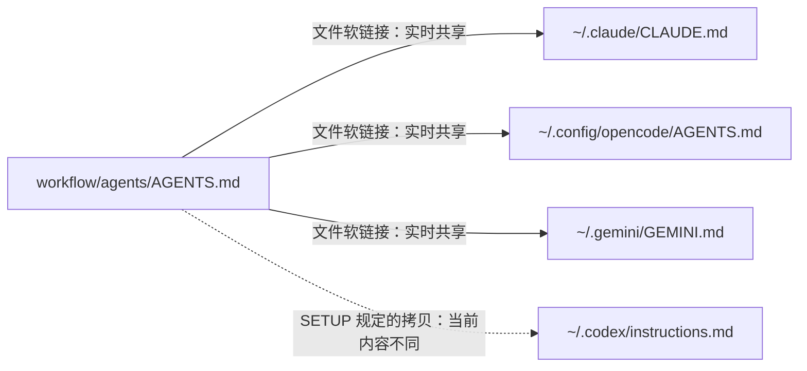
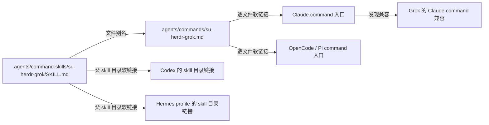

# macOS Agent 工作台：现状调查

调查日期：2026-09-15。配套文档：[产品与技术设计](03-macos-agent-workspace.md)。

本记录区分源码行为、本机文件状态、运行时发现结果和设计建议。未执行安装、同步、备份上传或配置修复；没有提交本机配置正文、凭据或会话内容。

## 1. 调查范围与依据

| 对象 | 调查时的版本背景 | 主要依据 |
| --- | --- | --- |
| Otter | HEAD `308cb15a474e`，工作区已完成尚未提交的 monorepo 迁移 | `apps/cli/src/collectors/`、`cli.ts`、`commands/`、`packages/core/src/types.ts`、`apps/macos/` |
| Workflow | HEAD `b931fd946689` | `SETUP.md`、`README.md`、`agents/`、`hermes/skills/`、`hooks/install.sh`、`grok/hooks/install.sh`、`pi/README.md`、两份 registration audit |
| Showtime | HEAD `25a7d6e56c4d` | `Package.swift`、`StudioView.swift`、`StudioWindow.swift`、`StudioTheme.swift`、`AutomationServer.swift`、`scripts/test*.py`、`docs/studio.md` |
| 本机 | 当前用户的已知配置目录及当前进程 PATH | `lstat`、`readlink`、严格路径解析、定向内容比较、包版本元数据、只读 discovery 接口 |

源码按调查时的工作区读取，以上 HEAD 不是“所有内容均来自干净提交”的声明。Workflow 的 `agents/skills/zhengli-caddy/SKILL.md` 当时已有未提交改动。

本次没有扫描整个磁盘，也没有启动模型任务。新的原生发现检查只运行了 Grok `inspect --json`、Codex app-server 的 `skills/list` 与 `config/read`，并分别使用 Workflow 和临时无关目录作为上下文。Claude、Pi、Hermes 的原生发现证据来自 Workflow 2026-09-14 的既有审计，不能冒充本次重新验证。

## 2. Otter 目前备份什么

默认共 **13 个采集器**。这是开发环境配置快照，不是系统镜像；安装清单不包含应用本体。

| 采集器 | 实际内容与边界 |
| --- | --- |
| Claude Code | `~/CLAUDE.md`、`~/.claude/CLAUDE.md`、settings、统计、插件清单、提示历史、会话索引摘要。没有完整采集 commands、rules、hooks、skill 包 |
| OpenCode | `.config/opencode` 配置文件；`.config/opencode/skills` 与 `.agents/skills` 的名称和简单 frontmatter 信息。skill 正文没有备份 |
| Shell | 常用 shell/git/editor dotfiles、SSH config/known_hosts；SSH key 只记录存在与元数据 |
| Homebrew | formula、cask、tap、pin 等清单 |
| Applications | `/Applications`、`~/Applications` 应用名称、版本等；图标有独立导出/上传流程 |
| VS Code / Cursor | 用户设置、快捷键、扩展清单等编辑器配置 |
| Docker | 经过遮盖的客户端配置与 context 清单，不备份镜像和 volume 内容 |
| Fonts | 字体清单，不复制字体文件 |
| Dev Toolchain | Node/Bun/Rust/Python/Ruby/Go 等版本、全局包或工具清单 |
| Cloud CLI | Azure、AWS、gcloud、Railway 等选定配置；不等同于完整凭据迁移 |
| macOS Defaults | 选定系统偏好导出 |
| LaunchAgents | 用户 LaunchAgents 的 plist 等，不包含完整系统服务恢复 |
| Hermes | 默认与命名 profile 的 `config.yaml`、`SOUL.md`、`memories/MEMORY.md`、`memories/USER.md`、`cron/jobs.json`，以及部分 skill 名称 |

重要细节：

- `--slim` 只排除 Claude 提示历史、会话摘要。它不会排除 Hermes memory、USER、SOUL 正文。
- Claude `history.jsonl` 当前上限是 5 MiB；通用文件上限 512 KiB。旧采集器文档仍有 2 MiB 说法，源码优先。
- 遮盖按格式和字段进行，部分 Markdown、memory、首条提示不做遮盖。不能将“配置备份”理解为“全部内容已脱敏”。
- `CollectedFile` 只有 `path/content/sizeBytes`。快照 v1 没有保存链接链、来源仓库、同步基线、权限模式或发现状态。
- `safeReadFile` 对指定文件使用 `stat`，会读取软链接目标，但不记录这个事实。`collectDir` 的 `Dirent.isDirectory()/isFile()` 分支则跳过软链接条目。
- OpenCode 与 Hermes 的 skill 枚举使用 `Dirent.isDirectory()`，跳过软链接 skill。Hermes 只看第一层目录，漏掉分类目录内的 skill。
- Hermes 在快照内使用 `~/.hermes/<profile>/<relative>` 虚拟路径，不能直接把它当成本机可编辑路径。

本机文件布局与现有 Hermes 枚举算法的对照：

| Profile | 当前算法能列出的直接实体 skill | 跳过的直接软链接 skill | 跳过的嵌套实体 skill |
| --- | ---: | ---: | ---: |
| default | 13 | 23 | 97 |
| cherry | 1 | 0 | 69 |

这些数字来自只读文件枚举，不是 Hermes 原生启用 skill 数量，也没有递归统计软链接目标里的更多内容。

CLI 当前行为：

| 命令 | 当前行为 | 对 App 的影响 |
| --- | --- | --- |
| `scan --save` | 保存本地 JSON | 可以作为现有本地快照入口 |
| `scan --json` | stdout 仍包含 `Scanning environment...` | 不能直接作为可靠 JSON 协议 |
| `backup` | 重新扫描 → gzip 上传 → 成功后本地保存 → 尝试上传图标 | “先预览、后 backup”目前会重新采集，不保证上传的是预览对象 |
| `snapshot list/show/diff` | 操作 `~/.config/otter/snapshots` | list/show 无完整结构化输出接口 |
| `snapshot diff` | 比较路径、大小和清单名称 | 等长正文修改、包版本变化可能漏报，不能作为配置漂移引擎 |
| `login` / `config` / `update` / `export-icons` | 现有 CLI 功能 | 应由 App 调用 CLI 复用 |
| restore | 没有自动恢复命令 | App 不能展示尚不存在的“恢复整机”能力 |

生产与开发配置文件分开，但 snapshots/icons 目录共用；`backup --dev` 只选择开发配置，上传 API 地址仍由 `OTTER_API_URL` 等现有逻辑独立决定。

## 3. Workflow 是怎样连接各个 harness 的

实际源目录有 **21 个个人 skill、21 个 Hermes skill、2 个 command skill、13 个 command 入口、6 个 Markdown rule**。13 个 command 中的 2 个是 command skill 的别名，不能再算成 2 份独立正文。README 中 Hermes “17 个”的数量已落后于目录现状。

### 3.1 全局指令与项目模板

- 上述三个软链接均正确解析到 canonical 文件。
- Codex 拷贝为 3,595 bytes，Workflow 源为 4,843 bytes，内容不同。仅凭差异无法区分“未同步”与“用户有意改写”。
- 当前没有 `~/.codex/AGENTS.md` 或 `AGENTS.override.md`；原生 `config/read` 返回 `model_instructions_file: null`、空 fallback filenames、32,768 bytes 项目指令上限。按照当前官方发现规则，这份 `instructions.md` 不是已配置的默认全局入口。拷贝内容同步和加载入口修复是两个问题。
- `model_instructions_file` 是替换内置指令的配置，不能为了共享 AGENTS.md 就随意设置它。设计应优先对接当前版本支持的 AGENTS 发现机制，再让用户审阅配置变更。
- `agents/templates/CLAUDE.md` 是项目 handbook 模板，按仓库复制并填写。模板与项目文件不同属于预期定制，不能像全局指令一样强制保持同文。

### 3.2 Skills、commands、rules

| 资源 | 源 → 中间层 → 入口 | 本机观察与语义 |
| --- | --- | --- |
| 个人 skills | `workflow/agents/skills/<name>` → `~/.agents/skills/<name>` | 21/21 为逐 skill 软链接；共享桶另有 7 个实体目录 |
| Claude skills | 共享桶 → `~/.claude/skills/<name>` | 20/21 Workflow 入口；缺少 `zhengli-teams-hackathon-video` 专用链接，当前 Claude 原生发现未重测 |
| OpenCode skills | 共享桶 → `~/.config/opencode/skills/<name>` | 同样 20/21；当前 PATH 未发现 OpenCode CLI |
| Codex skills | 原生扫描共享桶；旧 `~/.codex/skills` 也有兼容入口 | 专用目录 20/21 不构成缺失：本次原生发现确认新 skill 在仓库外也启用 |
| Grok skills | 共享/用户目录、Claude 兼容与项目目录 | 本次原生发现确认新 skill 在仓库外启用；无需为每个 skill 再复制到 `.grok/skills` |
| Pi skills | 原生扫描共享桶及 `.pi/agent/skills` | 不要求再建一套 Workflow skill 链接；Pi package/extension 还有独立发现机制 |
| 普通 commands | `workflow/agents/commands/*.md` → Claude commands / OpenCode commands / Pi prompts | 三处各 13/13 正确链接 |
| Grok commands | Claude 用户 commands 兼容；仓库内使用 `.agents/commands` 等项目入口 | 没有 `~/.grok/commands` 不代表缺失；本次发现确认两条 Herdr command 可用 |
| Codex legacy prompts | `~/.codex/prompts/*.md` → 普通 command 文件 | 11 个链接存在；官方已弃用，Workflow 既有审计记录 0.154.0 菜单不可用，不能算作已注册 command |
| Markdown rules | `workflow/agents/rules/*.md` → Claude / OpenCode / Grok rules | 三处各 6/6 正确链接 |
| Codex permission rules | `~/.codex/rules/*.rules` | 原生 `prefix_rule(...)` 权限 DSL，不能放入共享 Markdown rule |

家庭目录的 commands/skills/rules 是多来源汇集点：保留实体目录，在其内部逐条链接。仓库内部 `.agent`、`.agents`、`.claude`、`.codex`、`.gemini`、`.opencode` 的 commands/rules/skills 则是指向 `../agents/*` 的目录软链接。这两种目录用途不同；不能把仓库内部别名也报成“汇集点整体链接错误”。目录存在同样不能证明相应 runtime 认识该目录。

新 skill 的实际案例：

| 检查上下文 | Codex 0.154.0 | Grok 1.0.30 |
| --- | --- | --- |
| Workflow 内 | 发现 `zhengli-teams-hackathon-video`，repo scope，enabled | 发现同名 skill，project source，user-invocable |
| 临时无关目录 | 发现同一 canonical skill，user scope，enabled | 发现共享桶入口，user source，user-invocable |

Codex 两次返回各 51 个 skill，解析错误 0；Grok 两次各 55 条 skills/commands 混合项。不同 harness 的数字口径不同，不能直接横向当作完整性评分。

### 3.3 同一份正文，两种调用格式

`su-herdr-pi` 使用同样结构。Claude/Grok/Pi/Hermes 使用 `/su-herdr-*`，Codex 使用 `$su-herdr-*`。Workflow 审计特别记录：Codex 0.154.0 能发现 skill 目录软链接，但“实体目录内仅 SKILL.md 是软链接”的尝试没有被发现。正文相同，不代表注册形态与参数展开方式相同。

### 3.4 Hooks、Pi extension 与多来源副本

- Claude 有 3 个 Workflow hook 脚本链接，settings 注册 Bash PreToolUse。Grok 使用独立的 3 个脚本、`workflow-pretooluse.json` 和 `run_terminal_command` matcher，payload 为 camelCase。两套安装器的 `--status` 本次均通过。
- Grok 的 Claude rules/hooks compatibility 关闭，agents/commands/skills 共享仍保留。兼容关系必须按功能显示，不能只有一个“兼容 Claude”开关。
- Pi 当前 package 配置包含第三方扩展、`pi-retry` 和 `managed-packages/pi-agent-policy/current`。后者链接到本机发行副本 `releases/0.1.2-8c95e923ddc4`，不是源码 checkout。`workflow/pi/README.md` 已明确迁移到独立 `pi-agent-policy` 仓库。
- `cloudflare/SKILL.md` 在 Claude、Codex、OpenCode 三处都是实体文件，本次入口正文 hash 相同。这只证明入口正文一致；没有证明整包一致、安装来源或自动同步关系。
- `zhengli-machine-setup/SKILL.md` 仍有 Codex `rsync --delete` 的旧描述，而最新 SETUP 明确禁止清空多来源汇集目录。App 的规则依据应标注来源与版本；不能执行文档里提取出来的任意 shell 命令。

### 3.5 Hermes 不是单一配置目录

本机有 default (`~/.hermes`) 和 `cherry` (`~/.hermes/profiles/cherry`)。两者各自拥有实体 SOUL、MEMORY、USER、config、cron，不能假定身份与记忆应相互同步。

- default 有 23 个直接 skill 链接：19 个指向 `workflow/hermes/skills`、1 个个人 skill、2 个 command skill、1 个其他仓库 skill；另有大量实体与分类目录。
- Workflow 当前有 21 个 Hermes skill；`github-repo-research` 与 `herdr-control` 没有 default 同名直接入口。
- cherry 的 `herdr-control/SKILL.md` 是实体文件，8,654 bytes；Workflow 同名源 8,685 bytes，内容不同。没有同步基线，暂只能归类为“同名不同内容，关系待确认”。
- 两个 profile 的 config 都没有 `skills.external_dirs`。然而 cloning skill 推荐通过该配置指向 `workflow/hermes/skills`，Hermes 本机 loader 也支持 external dirs 与受信任项目目录。这是除文件软链接外的另一种实时引用。
- persona setup 要求按 profile 生成独立 SOUL，并转换继承的 MEMORY/USER；它描述的是有意分化。不能对所有 profile 执行全目录同步。
- default 当前缺少某 source 的直接入口是文件事实。只有加入了该 profile 的期望管理范围、排查其他入口并验证 runtime 后，才能升级为“遗漏安装”的诊断。

## 4. 安装状态

| 工具 | 本次当前 PATH / 元数据 | 原生发现验证 |
| --- | --- | --- |
| Claude Code | `~/.local/bin/claude` → 2.1.265 版本文件 | 本次未重测；参考 09-14 audit |
| Codex | Homebrew 全局 npm 包 0.154.0 | 本次 `skills/list`、`config/read` |
| Grok | `~/.grok/bin/grok` → 1.0.30 版本文件 | 本次 `inspect --json` |
| Pi | Homebrew 全局 npm 包 0.85.1 | 本次未重测；参考 09-14 audit |
| Hermes | `~/.hermes/bin/hermes` → venv 入口 | 本次未重测；09-14 audit 为 0.21.1 |
| Herdr | Homebrew 0.9.0 | 终端/会话协调器，单独建模，不混入 skill host 数量 |
| OpenCode / Gemini | 当前 PATH 没找到；用户配置目录仍在 | 未验证；显示“配置存在，CLI 未定位” |
| Otter | 当前 PATH 没找到全局 `otter`；本仓库有 CLI 源码与构建入口 | App 需要内置可调用版本及选择已有版本的入口 |

PATH 检查不能证明整机绝对没有某应用，也不反映所有 shell、GUI 或正在运行进程的环境。

## 5. 对设计的直接约束

1. 文件存在、内容相同、来自同一源、被 runtime 发现、当前会话已加载，必须是不同状态。
2. 源文件、汇集入口、目录别名、配置引用、拷贝/分叉关系都要可见；symlink 的每一跳不能丢。
3. “有意的本地定制”“受管理的拷贝”“同文的独立安装”都不应被统一修复成软链接。
4. 编辑 skill 必须按完整目录工作。Workflow 的 frontmatter 已含 `tags`、`related_skills`、`platforms`、`version` 等扩展；不能用单一 Codex quick validator 把它们统统判错。
5. 现有备份链路继续由 CLI 负责；本地关系索引与修改前检查点需要更完整的文件语义。

## 6. 官方格式依据

- [Agent Skills specification](https://agentskills.io/specification)：frontmatter、目录、命名、可选字段与资源组织。
- [OpenAI Build skills](https://learn.chatgpt.com/docs/build-skills)：共享桶、repo/user/admin/system scope、skill 目录软链接、openai.yaml 与启用状态。
- [OpenAI AGENTS.md discovery](https://learn.chatgpt.com/docs/agent-configuration/agents-md)：全局/项目链、override/fallback、字节上限与会话加载时机。
- [OpenAI Custom prompts](https://learn.chatgpt.com/docs/custom-prompts)：已弃用状态。页面残留的通用用法不能替代本机版本的实际发现结果。
- [Codex config reference](https://developers.openai.com/codex/config-file/config-reference)：`model_instructions_file` 替换内置指令的含义。

本地补充依据：`skill-creator/SKILL.md`、`references/openai_yaml.md`；Workflow `docs/registration-audit-2026-09-11.md` 与 `docs/registration-audit-2026-09-14.md`。校验规则应携带规范来源、验证过的 harness 版本与检查日期。
