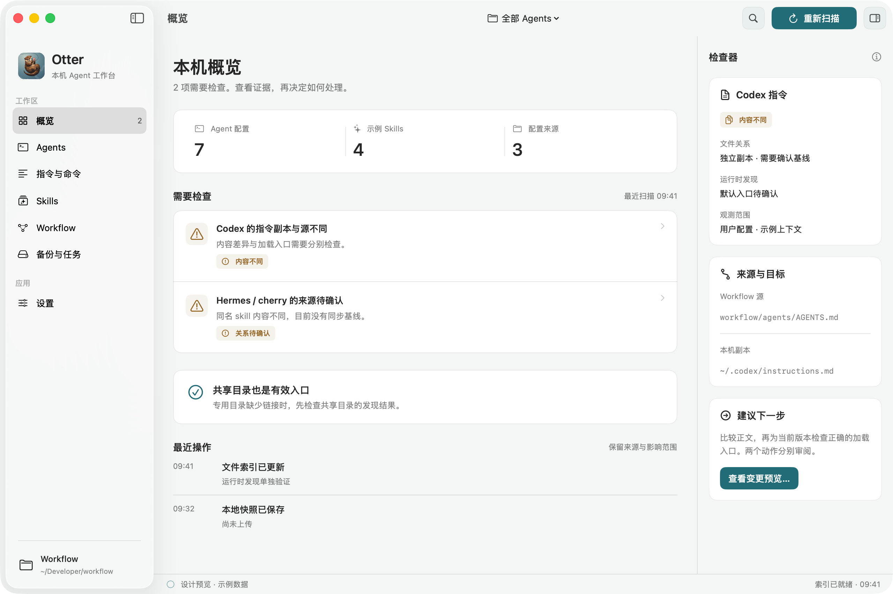
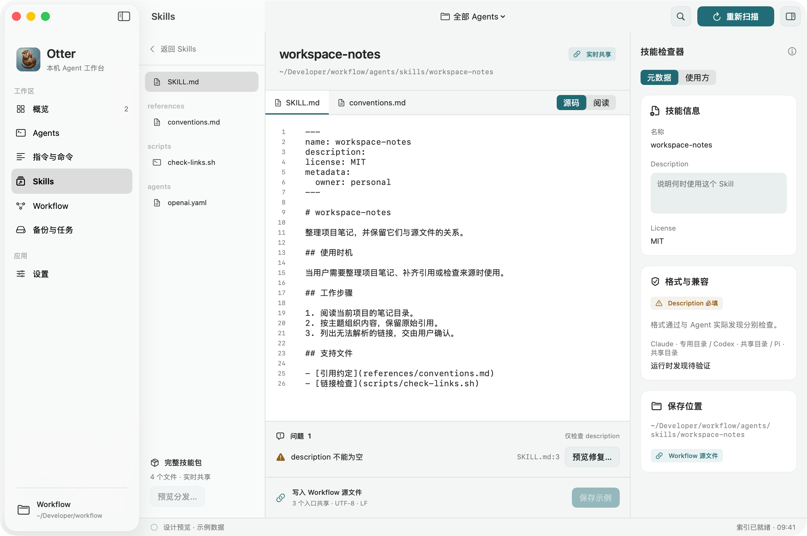

# Otter for macOS：本机 Agent 配置工作台

状态：设计已进入原生实现；实际功能与验证边界见[实现记录](03-macos-agent-workspace-implementation.md)。本文保留完整产品目标和最初设计预览。2026-09-15。

[现状调查与证据](03-macos-agent-workspace-audit.md) · [控件与交互规格](03-macos-agent-workspace-ui.md) · [原生预览画廊](../design/macos-agent-workspace/index.html) · [交互草图](assets/03-macos-agent-workspace.html)

## 1. 产品定位

Otter 帮助用户看清、维护和备份自己的 Mac 开发环境。macOS App 的主工作区围绕 Agent 配置：**这份配置在哪里、谁在使用、来自哪里、是否生效、修改会影响谁。** 现有 Otter CLI 继续负责环境采集与备份，Web 继续展示远端快照。

完整产品需要交付四条闭环：

| 用户目标 | 操作闭环 | 完成的判断 |
| --- | --- | --- |
| 了解本机，发现脱节或错误 | 扫描 → 查看证据 → 预览修复 → 应用 → 复查 | 能解释错误原因，也能说明未验证的部分 |
| 管理各 harness 指令和 commands | 选择 harness 与项目上下文 → 查看来源/覆盖顺序 → 编辑 → 同步 → 检查发现 | 用户知道编辑了哪个文件、哪些会话需刷新 |
| 发现、查看、编辑各处 skills | 全局搜索 → 定位完整 skill 包 → 编辑正文/附属文件 → 校验 → 保存/分发 | 多文件编辑、版本比较、兼容检查与撤销完整可用 |
| 控制本机 Otter CLI | 检查 CLI → 扫描/登录/备份/比较 → 查看任务结果 | 真实执行 CLI，输出和产物可追溯 |

本次调查已确认几个决定产品模型的事实：

- Workflow 是多来源配置网络中的一个源；用户目录是汇集点。
- 一个正文可以同时作为 Claude command 和 Codex/Hermes skill。
- Codex 旧指令拷贝内容不同，而且默认配置没有加载该路径；同步文件不能单独解决生效问题。
- 专用目录没有链接也可能正常：Codex/Grok 本次能从共享桶发现新 skill。
- Hermes 有独立 profile、嵌套 skill 与配置中的外部目录引用。
- 当前备份没有完整保存 skill 包与链接语义，不能直接用历史快照还原本机关系图。

## 2. 信息架构与 macOS 体验

下面是原生 SwiftUI 设计预览，使用 Lyre 的单窗口资料库布局，以及从 Lyre / Showtime 复制适配的控件。[预览画廊](../design/macos-agent-workspace/index.html)展示设计阶段的深浅色、紧凑编辑和变更状态；[运行说明](../design/macos-agent-workspace/README.md)提供设计预览的复现命令。实际 `apps/macos` 现已包含扫描、文件事务、编辑器和 CLI，验证入口见[实现记录](03-macos-agent-workspace-implementation.md)。



### 2.1 主窗口

采用 SwiftUI + AppKit 原生窗口。保留系统红绿灯、统一 toolbar、拖动、双击、全屏与恢复行为；沿用 Lyre 的 `NavigationSplitView` 主导航和 Showtime 的窗口/自动化方式。默认内容布局 1280 × 800 pt，最低 1000 × 680 pt，初始窗口限制在屏幕可用范围内；系统标题栏另占高度。窗口大小、可调栏宽、位置和面板偏好按窗口保存，恢复时检查显示器是否仍可用。

| 侧栏入口 | 中间工作区 | 右侧 Inspector |
| --- | --- | --- |
| 概览 | 已发现 harness、需处理问题、最近变更、备份状态 | 选中问题的证据与下一步 |
| Agents | Claude、Codex、Grok、Pi、Hermes；配置存在但 CLI 未定位的工具单列 | 版本、实际可执行路径、配置 scope、profile、发现能力 |
| 指令与命令 | 按 harness/cwd 筛选的指令链、rules、commands、hooks 注册 | 来源链、调用方式、覆盖/启用状态、受影响入口 |
| Skills | 全局资源库：按源、harness、profile、问题筛选 | 元数据、兼容结果、消费方、Git 状态 |
| Workflow | 来源列表、期望绑定、关系图、待同步差异 | 源仓库与目标入口、绑定方式、基线 |
| 备份与任务 | 环境采集、快照、CLI 任务进度与日志 | 真实命令、目标环境、结果与错误 |

资源编辑页使用“资源列表 → 内容”布局，进入技能包后用包内文件树替代库列表。主导航默认 212 pt，文件树 200 pt，Inspector 280 pt；实际工作区不足 980 pt 时收起 Inspector，仍可从 toolbar 的 popover 查看。编辑正文优先保留至少 480 pt，不挤成四列细条。Settings / About 放在同一主窗口；具体栏宽、滚动、键盘和状态规则见[窗口与控件规格](03-macos-agent-workspace-ui.md)。

顶部只保留当前上下文、搜索、扫描和当前页的主要动作。`⌘K` 搜索文件、skill、command、harness 与诊断；`⌘F` 查找当前文档；`⇧⌘F` 搜索当前 skill 包；`⌘S` 保存；`⌘Z/⇧⌘Z` 撤销/重做；`⌘,` 打开 Settings。菜单栏同时提供全部入口。

### 2.2 视觉和交互规则

- 保留现有 Otter 水獭图标与青蓝色主色。工具栏用透明前景资源，Dock 用符合 macOS 规范的 app icon。
- 使用 Lyre 的 32 pt 按钮、26 pt 页标题、28 pt 页边距与原生列表；借用 Showtime 的动态颜色、Inspector 分组、真正的 NSMenu 和轻量反馈。保留 Otter 青蓝色，系统语义文字色响应外观与可访问性设置；高对比度仍需专项实测。
- SF Pro 用于界面，系统等宽字体用于路径和代码；正文基准 13 pt，可调编辑字号。采用 8/12/16/24 pt 间距，资源行以信息密度和可点击性平衡。
- 状态使用文字与图标：`实时共享`、`独立副本`、`源已更新`、`已分叉`、`链接失效`、`未验证`。颜色仅辅助表达。
- 默认按问题与资源组织。关系图是选中资源的解释视图：先显示源、入口和消费者，按需展开中间跳转，避免首次打开就铺满所有边。
- 路径支持 Finder Reveal、复制路径、Quick Look、拖入资源/源目录；用户可以从编辑器打开独立窗口，同时比较两个 harness。
- 轻量成功使用状态栏或短暂 Toast；冲突、扫描失败、未保存内容保留在对应资源处，可再次处理。扫描不抢焦点、不清空选择、不抹掉未保存的编辑。
- VoiceOver 能读出“资源、scope、来源、状态”；焦点顺序、键盘多选、上下文菜单、中文输入法、减少动态效果均纳入验收。

### 2.3 首次打开与持续扫描

首次启动先显示本机已知入口的元数据扫描，随发现逐步填充。若链接已经指向 Workflow，自动识别并展示该源；用户可以添加或更换源码目录。没有 Workflow 的机器也能使用资源浏览和编辑。

扫描分两层：

1. **文件层**：已知配置路径、PATH 候选、用户 Applications、选定项目、已登记 source、插件 manifest 声明的路径。默认不全盘递归，不加载 shell rc 或运行目录内的脚本。
2. **运行时层**：用户执行“验证发现”，使用对应 harness 的只读发现接口，固定 cwd/profile、记录版本与时间。新版本或未知接口标注未验证；不得通过发送模型任务来猜测是否可用。

FSEvents 监听汇集点、已解析源目录及链接祖先。事件合并后增量重扫，保存后立即刷新受影响资源；休眠恢复、根目录变更、事件丢失后重新建立索引。中断扫描保留已完成结果并标注覆盖范围。

### 2.4 从参考项目直接复用

复用落实到源文件和符号：[控件复用表](03-macos-agent-workspace-ui.md#1-参考基线与复用方式)列出复制位置、必要修改与测试。已在隔离预览中采用 Lyre 的 `LyreButtonStyle`、`LyreCard`、`LyreSection`、`LyrePageHeading`，以及 Showtime 的 `InspectorSection`、`StudioMenu` 和动态 `NSColor` 写法，统一改名为 Otter 并保留 MIT 许可。

状态借鉴 Lyre 的 `RecordingLibraryState`：App 持有编辑会话和任务，切换页面不销毁草稿。窗口验收借鉴 Showtime 的真实 AppKit 输入；设计截图借鉴 Lyre 的隔离宿主和本进程截图。直接复制小型控件，不引入跨仓库 UI 框架、录音/视频业务或相邻 checkout 的运行时依赖。Lyre 的参考包含未提交改版，[来源记录](../design/macos-agent-workspace/SOURCES.md)明确记录文件版本。

## 3. 关系模型：文件状态和实际生效分开

### 3.1 模型对象

| 对象 | 关键内容 |
| --- | --- |
| Harness installation | family、版本、实际 binary/bundle、检测依据；配置残留与已定位安装分开 |
| Context | 用户 scope、选定 cwd/project、profile、发现时环境路径；影响规则加载与优先级 |
| Resource | instruction、Markdown rule、permission rule、command、skill package、hook、settings、persona/memory、extension |
| Source | Workflow/其他 Git checkout、第三方安装包、系统内置、本地自建；源身份与本地路径独立保存 |
| Entry | harness 实际入口路径、entry kind、整个解析链、最终文件身份、读取错误 |
| Binding | 期望 source/target、link/copy/fork/config-reference 模式、管理范围、证据与同步基线 |
| Observation | on-disk、可读取、格式结果、预测可发现、原生已发现/已禁用、观察版本和时间 |
| Change set | 目标字节、入口操作、前置条件、影响范围、修改前内容、操作结果 |

图的方向统一为“源 → 入口 → 消费方”。保存原始 `readlink` 文本和每一级祖先目录链接；不能只保存最后的 `realpath`。

全局 instruction、项目 instruction、路径规则、Codex 权限 DSL、Hermes SOUL/MEMORY 是不同角色。界面称为“指令与配置”；无法从本地文件完整重建厂商隐藏的系统提示。只有 harness 返回了实际加载证据，才标为“已加载”；通常只能验证新进程发现，不能代表所有运行中的旧会话。

### 3.2 关系状态的判定

| 显示 | 判定证据 | 默认动作 |
| --- | --- | --- |
| 实时共享 · 文件/目录链接 | 某一级入口为 symlink，完整链解析到 source | 打开源文件，显示所有消费者 |
| 实时共享 · 配置引用 | 已解析配置引用外部资源目录，adapter 确认语义 | 查看配置引用与实际发现结果 |
| 硬链接 | 本次扫描 dev/inode 相同、链接计数支持 | 单独提示写入语义，禁止静默用原子替换破坏共享关系 |
| 受管理副本 · 一致 | 明确 binding，源/目标包 manifest hash 一致 | 无操作 |
| 源已更新 / 本地已修改 / 两边已修改 | 有上次同步基线，分别比较 source/target/base | 更新副本、保留本地或三方合并 |
| 独立副本 · 内容一致 | 内容相同，但没有来源证据 | 查看/认领关系；不自动建立同步 |
| 已分叉 | 用户明确分叉，或已有 provenance 记录 | 独立编辑，按需查看上游差异 |
| 同名不同内容 · 关系待确认 | 只有同名或近似内容，没有基线 | 双栏比较；用户建立关系后再管理 |
| 链接失效 / 循环 / 无读取权限 | 文件系统明确返回对应错误 | 定位坏掉的一跳；权限错误不当作文件缺失 |

skill 身份是 source + 包内路径，安装入口另有身份；不能只用 `name` 去重。读缓存可按最终文件身份共享，但逻辑入口仍逐个保留。inode 用于本次关系判断，不作为跨扫描永久 ID。

完整包 hash 包含排序后的相对路径、类型、内容摘要与相关执行权限；不跟随未声明的任意外部链接。`SKILL.md` 相同而 `scripts/` 不同属于不同包。文件改名、源仓库移动、APFS 大小写/Unicode 路径问题需要保留原始路径，并根据文件系统实际行为判断。

### 3.3 可发现性是第二组状态

为每个 consumer 显示 `已发现`、`已禁用`、`被覆盖`、`只在项目内可见`、`待验证`、`接口不支持`，附 cwd/profile、版本、时间、来源路径。文件关系正常但 command 没有注册时，两组状态同时出现。

优先接入当前本机的五个 harness；OpenCode/Gemini 首版支持配置扫描和编辑，在可执行文件可用时再启用已验证的 adapter。Cursor、Copilot 等通过可扩展的静态规则加入，只承诺经过验证的入口与能力，不用通用正则假装支持所有 host。

| Harness | 应掌握的独立语义 |
| --- | --- |
| Claude | user/project instruction、rules、commands/skills、plugins、hook 注册；SDK initialize 发现及重启时机 |
| Codex | AGENTS override/fallback 链、共享桶、repo scope、skills 配置、native command skill、deprecated prompts、独立 permission rules |
| Grok | 分功能的 Claude compatibility、项目/全局优先级、native hooks、inspect 结果 |
| Pi | shared skills、prompt templates 的参数展开、package/extension 注册、`/reload` |
| Hermes | active/default/named/custom home、SOUL/MEMORY/USER、嵌套 skills、external_dirs、受信任项目目录、启用与 slash command |

adapter 能力表记录 binary 版本、匹配的规则版本、支持的读/写/验证能力。未知版本允许文件浏览；不会根据过时的路径规则自动搬移或修复。

## 4. 诊断和同步

### 4.1 问题必须可解释

每条问题包含：观察事实、期望依据、影响的 harness/profile、严重度、证据时间、建议动作。没有明确期望绑定时，不能把独立资源报成“偏离 Workflow”。

首批确定性诊断包括：断链/循环、source 移动、缺失的受管理入口、包内容漂移、同名冲突、入口被覆盖、非法 frontmatter、失效本地引用、禁用配置、指令入口未加载、hook 文件存在但未注册、CLI 未定位或协议不兼容。MCP/extension 仅检查配置结构、引用程序/路径和必需环境变量的存在状态，不显示密钥值或通过连网猜测凭据有效性。

“description 是否足够清楚”等建议归入写作检查；不使用固定 MCP 数量、skill 数量或简单文本长度生成健康评分。`zhengli-machine-health` 的风格启发与官方格式错误分开展示。

真实问题的建议呈现：

| 本次实例 | App 显示 | 可审阅的后续动作 |
| --- | --- | --- |
| Codex instructions 拷贝不同且无默认加载入口 | 内容不同；默认入口未配置 | 比较内容，选择保留/合并；为当前版本建立正确 AGENTS 入口，两个动作分别展示 |
| Codex 没有新 skill 的专用链接，但 shared bucket 已发现 | 共享目录发现正常 | 无需新增冗余链接 |
| Claude 缺少新 skill 的专用链接 | 与 Workflow 绑定配方不同；runtime 待验证 | 先验证发现，再预览补齐单个入口 |
| cherry 与 Workflow 的 herdr-control 内容不同 | 关系待确认 | 查看双栏差异，选择本地分叉或建立受管理副本 |
| OpenCode/Gemini 配置存在但 PATH 没有 binary | 配置存在，CLI 未定位 | 选择现有程序路径；保留可编辑配置 |

### 4.2 Workflow 的期望关系

`SETUP.md` 是当前人类可读配方；App 的 scanner 不执行 Markdown 中的 shell。初版提供与已核实 SETUP 对应的预设，导入后展示拟管理条目、来源与不确定项。

后续可在 Workflow 添加版本化、纯声明的 `otter.workspace.json`，维护 source-relative 路径、目标 harness/scope/profile 和绑定方式。它是设计中的新增文件，本次没有写入 Workflow。App 可以独立扫描，没有 manifest 时也能显示观察结果。

管理规则：

- 每个源只管理自己明确登记的条目；保留其他来源的链接和实体目录。
- 安装/修复按单个入口生成 change set；不会清空汇集目录或执行 `rsync --delete`。
- 整体目录链接是否合适由目录角色决定：用户汇集点、仓库内部 alias、版本包的 current 指针分别处理。
- 从新 source 发现 skill 后提供“加入这些消费者”的预览；没有配置自动分发规则时不自行传播。
- intentional fork、项目模板实例、Hermes persona/memory 具有独立预期；可暂停某项同步或按证据版本忽略问题。

### 4.3 编辑和修改事务

普通编辑默认在本地保留草稿，`⌘S` 保存实际源文件；自动保存只写草稿。编辑器始终显示保存位置与已知消费者，例如“保存到 Workflow · Claude/Grok/Pi 共享；Codex 拷贝另需同步”。

对已绑定并会立即被消费的配置，保存到源就是一次发布：出现必需格式错误时保留草稿，明确显示“尚未写入源文件”，修复后再保存。未绑定的创作文件可保存为不完整内容；不能把“草稿已保存”显示成“配置已同步”。

保存链接背后的文件时，在最终源文件所在目录创建临时文件，再替换最终文件；不替换入口 symlink。对于未确认来源的副本，明确让用户选择“修改当前副本”“编辑已确认的源”“建立分叉”。不根据名字擅自选中另一个路径。

同步、重新链接、删除、重命名和多文件替换使用可审阅的 change set：

1. 展示增删改、完整目标路径、前后差异、受影响入口、需要刷新哪些 runtime。
2. 保存修改前字节与链接元数据；校验当前 hash、解析链、权限仍与预览一致。
3. 单文件原子替换，保留适用权限/执行位与元数据。多文件操作记录 journal，逐项应用与验证，不声称跨文件系统原子事务。
4. 中途失败时恢复仍符合后置条件的已写项；第三方后来修改过的文件进入冲突处理，不覆盖新内容。
5. 更新基线、重扫受影响资源，提供操作历史与撤销。撤销也检查目标未被外部修改。

有基线时使用三方比较；无基线时只提供双栏比较和显式选择。版本化 provenance 记录“从何处、何时、何版本复制”，不能由相同 hash 反推历史。源被其他编辑器修改时，未修改 buffer 自动刷新，脏 buffer 保留并提示合并。

## 5. 完整 Skills 编辑器



### 5.1 按包编辑

编辑器管理整个 skill 目录，包含以下交付项：

| 区域 | 功能 |
| --- | --- |
| 文件树 | 新建、导入、复制/分叉、删除、重命名、拖入资源、Finder Reveal；显示链接与外部目标 |
| 多标签内容区 | `SKILL.md`、references、scripts、templates、assets、`agents/openai.yaml`；支持分栏和独立窗口 |
| 原生文本编辑 | 语法高亮、行号、缩进、换行设置、括号配对、选区/行操作、长文档导航、撤销/重做、中文 IME、查找替换 |
| Markdown 视图 | 源码/预览/分栏、标题大纲、本地链接跳转、图片和代码块预览；预览不执行脚本或 inline shell |
| 元数据表单 | name、description、license、compatibility、metadata 与当前 harness 扩展；表单和源码使用同一个编辑 buffer |
| OpenAI metadata | openai.yaml 的界面元数据、图标、默认提示、invocation policy、MCP dependencies 编辑与预览 |
| 包级查找与重构 | 跨文件搜索、带预览的替换；改名时列出 Markdown 引用、command alias 和注册入口的影响 |
| 版本/关系 | 源码 Git diff、磁盘差异、上游/副本对比、同步基线、修改前检查点、变更撤销 |
| 分发 | 选择 harness/profile，使用其支持的绑定形态；预览后安装/同步/移除自己的绑定 |

图片、PDF 等二进制资源支持预览、添加、替换和导出；内容编辑交给适合的外部应用，返回后自动检测变化。源码编辑覆盖常见 Markdown/YAML/JSON/TOML/Shell/Python/JS/TS，格式不认识时仍保留为文本，不损坏文件。

包重命名只重写已解析且属于管理范围的引用；跨源或普通 prose 中的同名词汇列为待核对，不盲目全文替换。外部 URL 检查是可选独立动作；离线格式检查不依赖网络。

### 5.2 格式校验分层

| 层 | 校验内容 | 行为 |
| --- | --- | --- |
| 基础解析 | UTF-8/换行、frontmatter 边界、YAML mapping、重复键、语法定位 | 解析错误带行列和修复说明，原文仍可编辑 |
| Agent Skills 规范 | name/description 必填及类型、1–64 字符命名约束、目录名、description 1–1024、可选 compatibility 1–500、metadata 类型 | 显示规范版本；创建默认使用跨 host 兼容命名 |
| Harness 兼容 | Claude 的调用/权限字段、Codex openai.yaml/skill 开关、Hermes tags/related_skills、Pi 模板语义等 | 按目标 host/version 分列；不把不支持等同于通用格式非法 |
| 包完整性 | Markdown 本地引用、缺失脚本/图片、链接循环、包内外来源、大小与执行位 | 明确检查范围；已登记外部引用不自动判错 |
| Workflow 约定 | 源目录归属、command-skill alias、consumer 绑定、导入模板约定 | 独立可配置，不污染通用规范 |
| 写作建议 | 触发描述、重复段落、过长入口、引用组织 | 可关闭的建议，不能冒充 parser 错误或阻止保存草稿 |

使用真正的 YAML parser；现有 OpenCode collector 的逐行正则不足以解析块标量、数组、嵌套对象。也不能直接把 Codex `quick_validate.py` 作为所有 harness 的唯一校验器：其允许字段集比开放规范和 Hermes 本机资源都窄。

未知 frontmatter 字段、注释、排序、引号、块标量、CRLF 必须保留。结构化表单只对确定的源码范围做最小改动；无法无损编辑的复杂 YAML 留在源码模式，并解释原因。不会用一次 parse/serialize 重写整个文件。

Problems 面板支持按文件/目标 harness 分组，点击定位行列；Quick Fix 可预览、可撤销。允许保存不完整草稿；向某 harness 发布时要求通过该目标的必需校验，未通过的项目仍可留在编辑区。

### 5.3 与实际发现联动

保存后自动更新文件层结果；运行时验证显示独立时间戳。既有会话的刷新方式按 host 给出：Pi `/reload`，其他 host 按当前版本能力重启或 reload。App 不擅自终止用户正在执行的 agent 任务。

用户可以输入一段示例任务，预览模板参数展开和最终引用文件列表。此处属于静态预览，不执行 skill 脚本、动态命令替换或向模型发消息。真实执行测试作为后续显式任务，记录运行位置和结果，不作为格式检查的隐式步骤。

## 6. CLI 控制与备份体验

### 6.1 使用已有能力

“备份与任务”提供登录、环境扫描、本地保存、快照浏览、内容比较、上传、图标导出、CLI 配置与版本管理。执行路径统一经过 CLI bridge，复用 `apps/cli` 的采集、认证、gzip、上传和本地存储逻辑。

任务包含 `queued → scanning → saving/uploading → complete/partial/failed/cancelled`；展示真实 collector 进度、错误和跳过原因，不按时间编造百分比。日志有折叠的原始诊断区，结果优先呈现快照与可操作错误。

用户选定 production/development 后，同时显示实际 API host 和配置文件，不能用 `--dev` 名称推断上传目标。认证由 CLI 管理，App 只获取遮盖后的状态；不调用会打印 token 的 `config get token` 来判断登录，也不另存一份凭据。

本地扫描和 skill 编辑无需登录。上传是明确动作。配置备份包含哪些正文、哪些只是清单，在预览中逐项可见；`slim` 的说明明确限定为 Claude 历史/会话摘要。

### 6.2 必须先补的 CLI 协议

下列协议已在 `apps/cli/src/commands/workspace.ts` 实现；此表保留设计约定，具体运行说明见[实现记录](03-macos-agent-workspace-implementation.md)：

| 接口 | 约定 |
| --- | --- |
| `otter capabilities --json` | CLI 版本、协议版本、支持操作/输出格式、平台、已解析的非敏感路径 |
| `scan --json` | stdout 严格单个 JSON，进度只走 stderr；保留人工终端模式 |
| `scan/backup --format ndjson` | 带 `protocolVersion/jobId/sequence/type` 的事件流；稳定开始、阶段、结果与错误消息 |
| `snapshot list/show/diff --json` | 可解码模型；内容与包版本差异真实比较，不能只比较字节长度 |
| `config show --json --redact` | 登录状态、配置位置、环境和实际 host，不返回凭据 |
| `backup --snapshot <id>` | 上传已经预览并固定的本地快照，避免预览后重新采集另一份数据 |
| 明确目录参数 | 为本地 CLI 配置、扫描根、输出目录提供参数，支持 fixture 隔离，不改测试进程的系统 HOME |

协议版本与快照 schema 版本分开。Swift decoder 接受未知的可选字段；不兼容大版本显示升级入口，不从彩色日志提取业务状态。stdout/stderr 同时异步读取，限定行大小、日志保留和取消超时，避免管道阻塞。

`Process.executableURL` 与 arguments 数组负责启动，不拼接 shell 字符串。工作目录和环境可重现，GUI 从 Finder 启动时不依赖交互 shell。用户可以选择现有 CLI，App 显示解析后的真实路径与版本，发现多份安装时保留选择。

关闭 App 时，正在上传的任务明确提示等待或取消；首版不建立常驻后台 daemon。取消网络上传后如无法确定服务端是否已接收，结果显示“上传状态待确认”，保留 snapshot ID，不声称回滚、不盲目重复上传。

### 6.3 分发一个开箱可用的 CLI

本机当前 PATH 没有 `otter`，因此首版不能要求用户先安装 npm/Node 才能备份。推荐 App 内置与本版本匹配的独立 CLI 可执行文件，同时允许切换已有兼容版本。

先验证 Bun standalone 编译现有 TS CLI、依赖资源、进程调用和签名后的运行能力。App 可以是 universal，CLI 采用独立 arm64/x86_64 helper，由 App 选择；不假定带附加资源的 compiled CLI 能直接通过 lipo 合并。若这条构建链不能满足发行条件，采用随包提供受支持运行时的同一 CLI，仍不重写采集器。

内部调用 bundle 中的 helper 不等于安装全局命令。用户点击“安装命令行入口”时，才安装到稳定的 `~/Library/Application Support/Otter/bin`，遵循 Showtime 的显式安装/更新模式；不自动改 PATH，不覆盖已存在的全局 `otter`。内置 CLI 随 App 升级；外部 CLI 的更新由用户显式触发。

### 6.4 两种快照各司其职

| 数据 | 用途 | 保存与分享边界 |
| --- | --- | --- |
| 现有 `Snapshot v1` | 环境采集和 Web 备份历史 | 继续由 CLI/Worker/Web 处理，保留旧快照兼容 |
| 本地 workspace checkpoint | skill 包的完整修改前内容、链接元数据、同步基线、撤销记录 | 本地保存，默认不进入云备份；文件权限限定当前用户 |

本地 checkpoint 不能从已遮盖的云快照还原出来。编辑保存也不能把 `[REDACTED]` 回写进真实配置。首次云端备份不自动扩大到所有新发现的 skill/记忆正文。

第一版修复现有 collector 的链接/嵌套枚举缺口，并在结果中如实标出收集与跳过范围。将完整 skill 包和来源图加入云备份属于显式新增范围：先定义可移植 manifest、来源路径映射、附件与筛选语义，再做上传/下载往返及旧 Web 的兼容验证。原生工作台的完成不依赖这个云格式扩展。

## 7. 原生技术结构

### 7.1 保持当前 monorepo 边界

```text
apps/macos/
  project.yml                    唯一 XcodeGen 工程来源
  Otter/
    App/                         Window、Toolbar、Settings、导航
    Features/                    Overview、Agents、Skills、Workflow、Backup
    Editor/                      NSTextView 桥接、预览、文件树、Problems
    Automation/                  仅测试构建启用的本机测试接口
  OtterCore/                     Foundation 模型与业务逻辑
    Discovery/                   文件解析链、host adapters、profile/cwd
    Workspace/                   来源、绑定、诊断、增量索引
    Editing/                     buffer、事务、基线、包级比较
    Validation/                  YAML/Markdown/host 格式规则
    CLI/                         Process 生命周期、协议解码
  OtterCoreTests/                 fixture 文件系统与模型测试
  OtterUITests/                  原生输入、窗口与无障碍检查
  Fixtures/                      合成 home/workflow/harness、假 CLI
apps/cli/                        现有 TS 采集与备份，引入结构化协议
packages/core/                   现有快照类型，增加 CLI 协议约定与 fixture
apps/web/ + apps/api/             现有单 Worker Web 发布
```

这是目标目录，不在本次设计中创建应用实现。沿用当前 macOS 15+、Swift 6、XcodeGen；不同时再引入第二份负责生成 App 的工程配置。

`OtterCore` 作为独立可测 target，不依赖 SwiftUI。借鉴 Showtime 的 Core/App 分离，但使用当前完整 Xcode 环境中的 Swift Testing/XCTest，不为绕开测试 SDK 再造 assertion runner。

### 7.2 各层职责

- Swift 原生 scanner 处理当前文件系统、来源关系、编辑事务与变更监听；TS collectors 处理已有备份范围。原生代码不重写 Homebrew、Docker、云配置采集和上传器。
- `@MainActor` 的可观察 workspace store 只发布 UI 状态；扫描、hash、解析与 subprocess I/O 在后台 actor/task 中进行。结果附 generation/context，旧扫描不能覆盖新选择或未保存文档。
- 配置、bindings 与 operation receipt 使用版本化 Codable 文件；索引首先在内存中重建，源文件是事实来源。无需图数据库或额外常驻服务。
- 代码编辑使用 `NSTextView`/TextKit。Markdown 与 YAML 使用成熟 parser，例如 `swift-markdown`、Yams；TOML 使用验证过的解析库。依赖只解决系统库缺少的格式能力，文本原文始终是编辑源。
- Markdown 预览优先原生渲染；确有布局需求时限于受控 WKWebView 预览，不承载导航、编辑器和主要 controls。
- 格式结果保存 range 和 rule ID，UI 和 CLI 协议契约共享测试样本。Swift/TS 各自只实现所属业务，不平行维护两套来源图引擎。

### 7.3 本地文件处理要求

逐级 `lstat/readlink` 记录链接；用访问集合和跳数/深度/文件数限制阻止循环。对断链保留完整已知链，权限不足单列。hash 只按需要计算，并缓存已经验证的完整文件内容；mtime/size 只帮助筛选，不能单独证明内容一致。

监听逻辑同时覆盖 alias 和 target，处理原子保存导致 inode 更换、source 根移走、checkout 切换、短暂不可读及恢复。改变源码根时重新验证 binding，不能只做字符串前缀替换。未解析完的 source 不显示为已删除。

写入前重新验证解析链和文件身份；对入口被重指向、另一进程已编辑、文件变成链接等情况拒绝套用旧计划。只在确认的目标目录内创建临时文件。archive 导入拒绝路径穿越；删除使用可恢复方式并只涉及选定资源。

开发者签名直接分发适合本地配置管理与 CLI 调用。普通配置路径读写不要求默认开启 Full Disk Access；遇到受保护目录时显示具体未覆盖路径，用户按需增加访问。产品不要求全局 Accessibility 或 Screen Recording 来完成自身扫描、编辑和测试。

## 8. 自动化测试与验收

### 8.1 继承 Showtime 的有效做法

参考 Showtime 的 `StudioWindow`、`AutomationServer`、`test_studio.py` 与 `test_agent_tools.py`：

- 通过真实 AppKit 事件/XCUITest 驱动点击、键入和滚动；直接操作 model 只属于核心测试，不能当作 UI 验收。
- 测试接口提供 status、window、accessibility tree、截图及测试输入；只在测试构建或显式测试模式启用，不默认开放编辑本机文件的 HTTP 服务。
- 如采用其 loopback 方案，绑定 `127.0.0.1` 的临时端口、校验 Host/Origin/session token，连接文件权限 0600；自动化操作仍经过同一 UI command 和事务逻辑。
- 每轮使用独立 app 副本、bundle ID、连接文件、fixture 根与输出目录；核对 `appVersion`、build ID、fixture ID 和 ready，避免测试旧进程或用户真实配置。
- 窗口/GUI 测试在解锁会话串行运行；等待实际布局与状态完成，不用固定长 sleep。输出截图和结构化结果，对失败保留现场。

### 8.2 测试层级

| 层级 | 关键场景 | 核心断言 |
| --- | --- | --- |
| 文件系统核心 | 直接/祖先/链式链接、断链/循环、目录移走、实体/硬链接、权限错误、Unicode、分类 skill、多源同名 | 关系与错误分类正确；受限遍历可终止；没有丢入口 |
| Context/adapters | repo 内外、profile 切换、shared bucket、compat 开关、disabled/override、旧 prompts、版本未知 | 文件状态与运行时状态分离，不误报本次已验证的 Codex/Grok 新 skill |
| 内容与 provenance | 等长修改、附属脚本差异、同文独立安装、源/目标/两边修改、无基线分叉 | 不用名称、大小或单个入口 hash 推断同步历史 |
| 编辑与事务 | symlink source 保存、外部改写、预览后重定向、部分失败/进程中断、撤销冲突、包改名 | 链接保留，其他源字节不变，草稿不丢，恢复结果真实 |
| 解析与编辑体验 | 块标量、未知 metadata、注释、CRLF、重复键、中文 IME、references、openai.yaml | 精确错误位置与无损往返；不执行任意脚本 |
| CLI 契约 | 缺失/旧 CLI、坏 JSON、stderr 洪流、超时/取消、production/dev、无 Node 的 Finder 环境 | 不死锁、不泄露 token、不误上传到另一个 host |
| 真实 CLI 集成 | 隔离配置/扫描根、实际打包 helper、本地模拟 API、快照预览后上传 | 真实 gzip 与保存产物；上传对象等于被预览的对象 |
| 原生 UI | 键盘完整流程、窗口/Inspector 恢复、搜索、编辑、比较、Quick Fix、取消任务 | 真实点击/输入改变磁盘和 UI；布局、焦点、状态均正确 |
| 发行包 | 新路径解压、移动/重命名 App、稳定 CLI 入口、签名、公证、架构 | 脱离源码可运行；执行后签名仍有效；声明实测架构 |

fixture 使用依赖注入的 roots 与专用 Otter 参数；不改真实 HOME、harness 设置或系统偏好。fake CLI 用于失败注入；成功路径必须另有实际打包 CLI 的集成测试。

### 8.3 四条发布验收旅程

1. **诊断到修复**：fixture 中的 Codex 指令拷贝不同且入口未配置 → 查看两种问题 → 选择合并与正确入口 → 预览 → 应用 → 文件检查与 adapter 发现都达标 → 撤销恢复。
2. **共享编辑**：从 Claude skill 入口打开 → 编辑源目录中的附属文件 → 保存 → 链接保持，所有已知消费者刷新 → 外部编辑制造冲突，原 buffer 保留。
3. **完整 skill 工作流**：创建包 → 添加脚本/图片/reference/openai.yaml → 找到并修复格式错误 → 重命名并更新受管理引用 → 向 Codex/Hermes 注册 → 原生发现 → 导出再导入的内容一致。
4. **CLI 备份**：Finder 启动且 PATH 无 otter/Node → 使用内置 CLI → 采集并预览 → 保存 → 模拟 API 接收已确认快照 → 比较等长文本改动 → 取消/网络错误可恢复，无遗留子进程。

### 8.4 体验指标

这些是目标；实际 App 的完整性能基线和跨设备体验尚未逐项测量：

| 场景 | 首版目标 |
| --- | --- |
| 冷启动可操作窗口 | 参考 Apple Silicon 机器 1 秒内；完整扫描异步继续 |
| 常用规模扫描 | 1,000 个 skill 包、10,000 个目录条目的 fixture，5 秒内完成元数据与首轮诊断；runtime probe 单独计时 |
| 搜索/选择 | 已建立索引后 p95 < 100 ms |
| 保存后增量结果 | 普通本地文件 1 秒内，保持焦点和滚动位置 |
| 编辑 | 10,000 行文档输入 p95 < 16 ms；大文件延后高亮而不阻塞打字 |
| 常驻空闲 | 不用轮询扫描，停止任务后无忙循环；在指定 fixture 记录 CPU/内存基线并检查回归 |
| 可访问性/外观 | 全键盘完成四条核心流程；VoiceOver、浅/深色、高对比度、减少动态效果、1000 × 680 最小窗口均验收 |

CI 记录硬件、OS、样本数和统计口径，不把某次机器速度直接当作跨机器保证。视觉快照覆盖主要界面、问题/空状态和最小窗口；人工复核中文输入、VoiceOver 与实际缩放体验。

## 9. CI/CD 与实施次序

Web 保持单 Worker、`apps/api` 部署和 `../web/dist` 静态资源路径。macOS 使用独立 workflow：native core、UI、CLI helper 打包、签名/发行分别验证；它的失败不会阻断现有 Web Release。涉及 CLI/协议/核心类型时，同时触发现有 TypeScript CI 与原生兼容测试。

原生发布前验证解压包、完整资源、版本、签名、公证和稳定 CLI 入口；不把本地 unsigned 构建当作最终发行。正式签名/发布由具体版本的发布授权驱动。

| 阶段 | 交付内容 | 进入下一阶段的条件 |
| --- | --- | --- |
| 0. 可行性与契约 | 打包 CLI、纯 JSON/事件协议、YAML 无损编辑样本、scope/adapters 契约 | Finder 环境真实 CLI 可运行；最难格式样本往返保真 |
| 1. 可解释的本机视图 | 文件 scanner、来源链、profile/cwd、双状态诊断、原生发现 | 复现调查案例，不误报 shared bucket、目录 alias 或独立 profile |
| 2. 可恢复的配置管理 | 指令/commands/hooks 编辑、差异、change set、基线、撤销 | 共享保存不破坏链接；并发和失败恢复验证通过 |
| 3. 完整 Skills 编辑器 | 多文件/资源编辑、元数据、校验、包重构、分叉与分发 | 第 5 节功能与技能发布旅程完整通过 |
| 4. CLI 备份闭环 | 任务界面、认证状态、快照预览、固定对象上传、内容比较、collector 漏项修复 | 实际 CLI 集成通过，旧快照/Web 回归通过 |
| 5. macOS 发行质量 | 窗口细节、键盘/IME/VoiceOver、性能、视觉回归、打包签名 | 四条验收旅程和发行包检查全部通过 |

阶段 1–2 可用于内部预览；对外的完整首版需完成全部阶段，不以一个 Markdown 文本框替代完整 skills 编辑器。

建议首先实现“发现来源 → 解释生效 → 可撤销修改”这一条纵向流程，再扩展完整编辑器和备份页；它决定用户能否信任后续所有批量操作。

设计阶段交付了调查、交互草图与隔离原生预览。后续实现已写入 `apps/macos` 与 CLI，测试仅操作明确的 fixture 和回环 API；没有修改本机 harness 配置或相邻项目。[实现记录](03-macos-agent-workspace-implementation.md)区分实际功能、自动化证据和发行前待验项目。

HTML 草图已用 Playwright 检查六页导航、harness/context 切换、来源图选择、示例必填项、编辑 buffer 保留、源码/预览、搜索、主题、任务完成与取消，以及窄窗口布局。原生设计预览的实际检查与截图另见[运行与验证记录](../design/macos-agent-workspace/README.md)；产品 App 的磁盘事务、真实 CLI 和完整编辑器验收仍按第 8 节执行，不能用预览结果代替。
