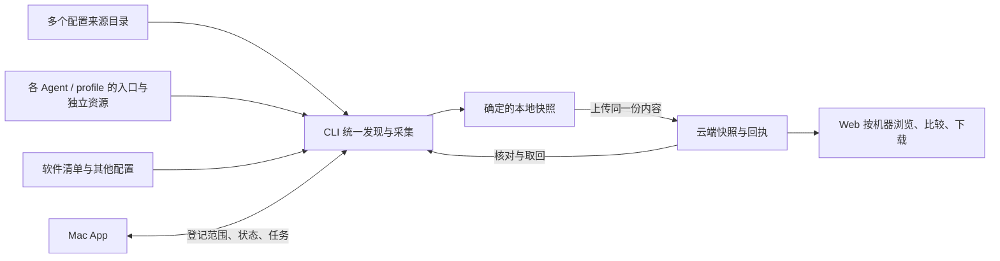

# Otter 3.0.0：配置来源、Agent 环境与可取回的备份

日期：2026-09-17。状态：3.0.0 功能与本地验收完成，发行说明见 [v3.0.0](https://github.com/nocoo/otter/releases/tag/v3.0.0)。评估基线：`main` / `2bd5871`，原产品版本 `2.1.0`。用户已确认本轮升级为 `3.0.0`，三个阶段均纳入本轮。

评估覆盖 Mac App、CLI、共享快照类型、API 存储链路和 Web 页面，并用隔离文件系统调用当前 CLI 验证漏备场景。界面参考现有原生截图，功能判断以当前源码为准。下文现状与漏备验证记录为改版前基线。实现与验证进度见文末；验证使用隔离样例。

**建议的产品定位**

Otter 保护跨机器使用的 Agent 配置和本机开发环境。用户应当随时知道：配置来自哪里、哪些 Agent 在使用、哪些修改尚未保护，以及机器不可用后还能取回什么。

Git 继续承担来源仓库的版本管理和跨机器同步；Otter 快照保存当时实际存在的配置内容、安装关系和环境清单，包括未提交、未推送、尚未纳入来源仓库的内容。

| 组成 | 本轮改版后的主要职责 |
| --- | --- |
| CLI | 统一发现、读取、生成快照、校验、保存本地、上传、查询远端、比较与导出 |
| Mac App | 展示本机状态，管理扫描来源，检查 Git 和 Agent 入口，协调 CLI 备份任务 |
| Web | 按机器查看云端历史，浏览来源与 Agent 配置，比较版本，下载可取回的内容 |

核心验收是：即使原机器和原 repo 都无法访问，仍能从一份已上传快照取回纳入范围的指令、完整 skill 包、各 Hermes profile 的配置，以及软件重装清单。脱敏文件、排除项和采集失败项必须有明确说明。

**一、现有能力与关键缺口**

| 领域 | 已有实现 | 对新目标的缺口 |
| --- | --- | --- |
| 多来源目录 | Mac 的 `sources` 支持添加多个目录；也能添加项目 | 配置保存在 App 的 `workspace.json`，未传给 CLI；来源扫描主要识别 `agents/skills`、`agents/commands`、`agents/rules` 等约定布局 |
| Agent 视角 | Mac 扫描 Claude、Codex、Grok、Pi、Hermes、OpenCode、Gemini；区分文件关系与运行时发现 | CLI 的专用 Agent 采集器只有 Claude、OpenCode、Hermes；两端发现能力不一致 |
| Git 状态 | 编辑器能查看单文件相对 `HEAD` 的 diff | Workflow 页没有 repo 的 branch、upstream、ahead/behind、staged/unstaged/untracked、Git 冲突或远端检查时间 |
| Skill 包 | Mac 已有目录清单、内容摘要、执行位、链接链和包操作 | CLI 的共享/OpenCode/Hermes skills 以名称清单为主；Claude skills、commands、rules 未纳入专门采集 |
| 符号链接 | Mac 能解析逐级链接；CLI 定点读取文件能读到链接目标；skill 枚举也能识别目录链接 | `BaseCollector.collectDir()` 只处理 `isFile()` / `isDirectory()`，跳过遍历中遇到的 symlink；快照没有保存链接关系 |
| Hermes profiles | 两端都认识 default 和命名 profile；CLI 保存 config、SOUL、MEMORY、USER、cron | skill 正文缺失；CLI 未跟随 `skills.external_dirs`；虚拟展示路径不能完整描述实际 profile 根目录与恢复位置 |
| 本地备份 | 已有 scan/save、list/show/diff；Mac 先保存再审阅上传；本地 JSON 原子落盘 | 普通 `otter backup` 先检查登录、上传成功后才本地保存，上传失败没有本地兜底；还没有内容变化驱动的“需要备份”判断 |
| 远端备份 | API 已有上传、列表、详情与删除；Mac 可上传已审阅的固定快照并核对 SHA-256 | CLI/App 没有本地与远端的统一清单、持久上传回执和接收结果不确定时的核对机制 |
| 重复上传 | 服务端存 R2 正文，再向 D1 插入记录 | 同 ID 重传可能先覆盖对象，再因重复主键失败；没有按内容摘要定义不可变、幂等的上传语义 |
| 软件与环境 | 已有 13 个采集器，含 Apps、Brew、Shell、VS Code/Cursor、开发工具、Docker、云 CLI、字体、系统偏好、启动项 | App 清单主要靠名称与版本，缺少稳定身份和安装来源；用户 LaunchAgent plist 目前只记名字；自定义文本路径和引用文件覆盖有限 |
| 快照模型 | v1 为 `machine + collectors.files/lists/errors/skipped` | 缺少稳定机器 ID、结构化来源/profile/入口关系、文件模式、包结构和逐项备份结果 |
| Web | Dashboard、快照列表、Config/Environment 详情、正文查看和 JSON 导出 | 主要围绕采集器数量和文件数；没有机器工作台、来源视角、Agent/profile 历史、版本比较与恢复导向的导出 |

现有编辑器、来源关系模型、固定快照上传、原子本地保存和原生交互可以复用。本轮主要投入应放在统一发现与备份链路，并重新安排信息层级。

**本次实际验证**

在临时目录中构造了共享 Workflow 指令、共享目录链接、独立 Claude/OpenCode skills、Codex/Grok/Pi/Gemini 本地配置、Hermes default/cherry 两个 profile，以及 Hermes 外部 skill 目录。每个 skill 都包含 `SKILL.md`、`scripts/run.sh` 和 `references/guide.md`。

调用当前结构化 CLI 的 `scan --json --scan-root … --collectors claude-config,opencode-config,shell-config,hermes`。这四个采集器是当前隔离扫描支持的文件采集器；其余环境采集器没有 Agent skill 正文采集逻辑。

| 样例 | 当前快照结果 |
| --- | --- |
| Claude 全局 `CLAUDE.md` 文件链接 | 保存目标正文，但没有链接元数据 |
| Claude 独立 skill、rule、command 链接 | 未保存 |
| OpenCode 普通 command 文件 / 链接 command 文件 | 普通文件保存；链接文件未保存 |
| OpenCode 独立 skill、共享 skill 目录链接 | 只进入名称清单 |
| Hermes default/cherry 的 SOUL 与 config | 两个 profile 均保存 |
| 两个 Hermes profile 的独立 skills | 只进入名称清单 |
| Hermes `external_dirs` 中的 skill | 未保存，也未列入 skills 清单 |
| Codex/Grok/Pi/Gemini 的本地配置与 skills | 未被这些采集器覆盖；默认注册表也没有对应专用采集器 |

结果是 **skill 内容文件 0 个、采集错误 0 个、进程退出码 0**。这说明目前的“扫描成功”描述的是既定采集器执行成功，无法证明用户关心的配置都已保存。本轮必须补上覆盖报告，明确指出哪些已发现的内容没有被保存。

**二、统一来源、入口和备份的概念**

建议将模型收敛为六类对象，保持清楚的职责。

| 对象 | 要表达的内容 |
| --- | --- |
| Device | 稳定的本机安装 ID、显示名称和平台；机器改名不改变历史归属 |
| Source | 用户登记的来源目录，可为 Git repo 或普通文件夹；包含可扫描的资源根、纳入范围和本机路径映射 |
| Agent instance | Agent 类型、可执行路径与版本、配置根、用户/项目作用域、profile；Hermes 每个 profile 独立建模 |
| Resource | 指令文件、rule、command、完整 skill 包、hook、配置或其他文本；有来源或本机独立两种情况 |
| Binding | 资源与 Agent 入口的关系：符号链接、配置引用、受管理副本、独立副本或主动分叉 |
| Snapshot | 一次确定的采集结果：内容、路径关系、环境清单、覆盖结果、创建时间和内容摘要 |

`Source` 的身份与本机绝对路径分开。另一台机器可以把同一来源映射到不同目录；remote URL 和同名目录只是识别线索。不同来源的同名 skill、不同 profile 的同名配置不能合并；内容相同只允许去重存储，不能推断为同一来源。

将“最新”拆开显示，避免用一个绿点混合几个不同结论。

| 状态 | 判断依据 |
| --- | --- |
| Repo 与上游的关系 | 当前 branch/HEAD 与最近一次成功 fetch 的 upstream；同时显示检查时间与失败原因 |
| Agent 入口与来源的关系 | 链接有效性、实际目标；副本用明确登记的同步基线比较；主动 fork 独立展示 |
| Agent 是否发现资源 | 当前配置、禁用/覆盖规则，以及经验证的只读发现接口；文件存在只能证明磁盘入口存在 |
| 内容是否已保护 | 当前内容与本地快照的差异、快照覆盖结果，以及指定账号/目标服务的远端回执 |

Git 分叉不等于已有合并冲突，工作区不干净也不等于需要修复；这些信息可以并存。运行时查询只证明该次新进程、该 cwd/profile 的发现结果，不能替代当前会话的加载证据。

**三、CLI：先完成可取回的快照**

**扫描范围采用来源与使用方的并集。** 每次备份同时扫描登记的来源目录、已知 Agent 配置根、共享 skills 入口、所有 Hermes profiles、配置声明的外部资源路径，以及用户补充的文件/目录。来源里尚未安装到任何 Agent 的资源也需要保存。

“是否纳入 Workflow 管理”与“是否备份”是两个独立属性。在已知 Agent/profile 目录里新增临时 skill，即使没有打开 App、没有登记来源，也应在下一次 CLI 备份时采集。即使格式暂时不符合 SKILL 规范，只要位于纳入范围的资源目录，仍保留可读取文件并标注类型待识别。扫描边界之外的内容通过追加路径纳入。

添加来源时先自动识别常见布局，包括根目录指令与嵌套资源；展示实际命中的路径，并允许补充资源根和忽略规则。登记一个普通文件夹后也能使用，不强制改成 Workflow 的目录结构。Git ignore 和未跟踪状态用于说明来源状态；明确纳入的资源根内，新文件不能仅因尚未加入 Git 就漏备。

**Skill 按完整包保存。** 默认保留 `SKILL.md`、脚本、references、assets 和包内其他必要文件。保留相对路径、文件类型、执行权限、原始 link target 和实际解析目标。小型二进制资源随包保存；依赖目录、缓存、大型文件等遵循明确的大小和排除策略，每一项排除都能查看理由。

对于符号链接，要同时保存入口关系与读到的实际内容。只记录 `/某台机器/workflow/...` 无法承担灾后取回。链接目标在其他目录时按同一套内容策略采集，记录目标归属；不能在快照缺少目标内容时把整个包标记为完整。目录链接、父目录链接、相对链接、链式链接、断链和循环分别处理，使用访问集合和遍历上限控制扫描。

`lstat/readlink/realpath` 与读取的字节共同生成记录；采集时重新核对文件身份和变更，遇到持续变化保留明确的 `unstable` 结果。管道、socket 等特殊文件不能作为文本读取。发现过程不执行 repo 内脚本或 skill 内容。完整快照表示其纳入范围内的采集完整，不承诺整个文件系统在同一时刻原子冻结。

**Agent 支持按真实能力实现。** 七类 Agent 的已知配置、指令、skills、commands/prompts、rules、hooks 和配置引用先纳入备份。具体入口和加载语义由各 Agent 的适配代码处理，记录已验证版本。Codex 权限 `.rules` 与 Markdown 行为规则保留不同类型；legacy prompts、配置存在但 CLI 未定位、接口版本未知都需要明确显示。配置根支持环境变量对应的显式路径和用户补充路径，保证 GUI 与终端使用同一份登记信息。

**Hermes profile 是独立备份单元。** default 和所有命名/显式登记 profile 分别保存 config、SOUL、MEMORY、USER、cron、完整 skills 及 `skills.external_dirs` 的资源。不同 profile 的人格、记忆和独立修改保持各自内容。共享 skill 可以去重字节，但保留每个 profile 的入口、启用信息与来源证据。profile 展示路径、原始真实路径和恢复时的根目录映射分别存储。

**保留环境采集器，并补齐文本内容。** Apps、Brew、语言工具、编辑器扩展、字体等继续提供重装清单。App 记录补充 bundle ID、安装路径和可确认的安装来源；Brew 保留 formula/cask/tap/version/pinned。Shell、编辑器、云 CLI 的配置文本继续保存；用户 LaunchAgent 的 plist 正文应进入快照。引用的自有脚本通过解析出的文件引用或用户补充路径纳入，无法可靠解析的动态引用显示待确认。

凭据文件遵循排除/脱敏策略，逐文件显示“原文保存 / 已脱敏 / 仅清单 / 按策略排除 / 读取失败 / 不支持”。当前脱敏分派没有覆盖 TOML、JSONC 和一般 Markdown；新增 Agent 配置与任意文本采集时必须一起补齐格式和内容处理。Hermes 人格、记忆正文的保留策略需要独立可见；不能把脱敏产物描述成无需补充凭据即可完整恢复的配置。必要文件未保存时，包的可取回程度与上传成功状态分别显示。

**备份生命周期先本地、再远端。**

1. 读取登记范围并生成确定的快照，同时记录采集结果。
2. 原子保存本地内容，完成本地格式与摘要校验；离线、未登录也能完成这一步。
3. 上传同一份已保存快照，保留已有固定 ID/hash 的审阅语义。
4. 服务端返回持久回执，客户端记录目标服务、账号、snapshot ID、摘要和接收时间。
5. 超时、取消或断连后标为“远端接收待核对”；查询回执，再重试原快照。

本地任务与上传记录要能跨 App 重启保留。远端删除与历史上成功上传是两种事实，分别记录最近一次核对结果。已有完整备份应在新备份部分失败、磁盘不足或重试时继续保留。

“需要备份”按内容与路径关系的稳定摘要计算。新增/删除/修改的文件、执行位、链接目标、包内容、清单版本和扫描范围变化都会影响结果；快照 UUID、创建时间、采集耗时不会造成每次都需要备份。扫描不完整时显示未知/部分结果，不把暂时不可读的目录判为全部删除。

沿用已有命令并补足少量操作；以下为 3.0 实际接口。

| 命令 | 能力 |
| --- | --- |
| `otter source add/list/remove` | 管理多来源，和 Mac 使用同一登记文件 |
| `otter workspace inspect --json` | 配置变更、repo 状态、Agent 入口和本地备份状态；Git 远端结果标注观测时间 |
| `otter source fetch <id>` | 显式刷新 repo 的远端引用并重新计算状态 |
| `otter scan --save` | 无需登录，生成并保存统一快照 |
| `otter backup` | 先本地保存，再按已配置目标上传；未登录/上传失败保留本地产物 |
| `otter backup --snapshot <id>` | 继续上传指定本地快照，复用已有摘要检查 |
| `otter snapshot list` / `otter snapshot timeline` | 本地列表 / 合并同一目标账号下的本地与远端版本 |
| `otter snapshot diff <a> <b>` | 比较资源、链接、profile 配置和环境清单 |
| `otter snapshot verify <id>` | 读取远端正文和回执，与本地快照摘要核对 |
| `otter snapshot download <full-id>` | 下载远端内容，核对 v2 回执并保存本地 |
| `otter snapshot export <id> --destination <directory>` | 导出文件、软件清单、路径映射和恢复说明；目标必须为新的绝对路径目录 |

`--json` / NDJSON 复用当前任务事件机制。CLI 应返回结构化的完整、部分完成与失败结果，不能只依赖文字日志或 collector 的错误数组来代表覆盖程度。

**四、Mac App：让本机状态成为主界面**

建议导航调整为“概览 / 配置来源 / Agents / 备份 / 软件与环境”，设置放在底部。指令和 Skills 进入来源详情、Agent 详情及全局搜索；保留已有编辑能力作为文件操作入口。

| 页面 | 用户首先看到什么 | 主要操作 |
| --- | --- | --- |
| 概览 | 上次本地快照、上次确认的云端快照、当前未保护变更、Git/链接/采集问题，以及这些结果的检查时间 | 立即备份；进入具体问题 |
| 配置来源 | 每个 repo/目录的资源数量、使用方、Git 状态和备份覆盖情况 | 添加目录；检查远端；查看变更/文件；打开 Finder/Terminal |
| Agents | 已定位的 Agent 和仍存在的配置；Hermes 的 profile 列表 | 查看各类配置、来源链和独立资源；验证支持的发现接口 |
| 备份 | 当前机器本地与远端版本的合并时间线、内容差异和覆盖结果 | 创建、上传、重试、核对、比较、导出 |
| 软件与环境 | App、Brew、语言工具、编辑器扩展等清单及上次快照后的变化 | 搜索；查看版本/安装来源；导出重装清单 |

概览里的每一条提示都应能进入具体文件或快照。例如“发现 3 个未登记来源的 skills，其中 2 个尚未备份”，比单独显示 skill 数量更有用。独立资源已经备份后，可以保留“本机独立”的属性，解除其丢失风险提示；用户不必先完成来源整理才能保护内容。

**配置来源的添加流程。** 选择目录后，自动识别 repo 根、资源根和指令文件，预览纳入范围与排除项；用户可补充未识别的文件夹。保存后同时对 App 和 CLI 生效。已经登记的 repo 允许包含多个资源子目录，多个 repo 也能同时向同一 Agent 提供资源。

来源详情包含 Git、资源、使用方和备份四部分。Git 状态至少覆盖 clean、staged、unstaged、untracked、unmerged、ahead、behind、diverged、无 upstream、detached HEAD、未初始化提交，以及读取/认证失败；普通文件夹显示“未使用 Git”。这些是可并存的字段，界面展示文字与计数。

本地状态可用 `git status --porcelain=v2 --branch -z` 等结构化输出读取。ahead/behind 必须对应明确 upstream。首次没有远端检查记录时显示“远端状态未知”；fetch 失败保留上次结果和时间。3.0 的 Git 操作以读取和显式 fetch 为范围，commit、pull、push、stash、冲突解决继续通过已有开发工具完成。

**Agent 详情以安装上下文组织。** 顶部显示版本、可执行路径、配置根和 profile；正文按全局指令、Skills、Commands/Prompts、Rules、Hooks、其他配置分组。条目展示名称、来源、入口关系和备份状态，具体链接链、加载证据、hash 和限制放入检查器。

Hermes 的 default、cherry 等 profile 有独立配置页与覆盖摘要。共享资源可从任意 profile 进入同一源文件；独立 SOUL、记忆和本地 fork 保持各自内容。“缺少某个期望入口”只能依据该 profile 明确登记的使用范围判断，不能默认要求所有 Agent/profile 都安装全部来源中的资源。

**备份页使用持久状态。** 每份快照显示采集时间、来源机器、文件/包/清单变化、完整性，以及“仅本地 / 待上传 / 已确认远端 / 远端待核对 / 仅远端”等位置状态。部分采集与上传成功可以同时存在，例如“已上传，2 个文件未能读取”。保留“最近一份完整快照”，避免新上传的部分结果掩盖旧的可用备份。

重新扫描和 FSEvents 共同更新本机状态。没有发生有效内容变化时显示“与上次快照一致”；上次扫描失败时显示需要重新检查。App 中未保存草稿与磁盘上的 Agent 配置分开呈现，不能把尚未写入文件的编辑当成 Agent 已使用内容。

**五、Web：按机器浏览与取回配置**

Web 首页改为机器总览，选择机器后查看它的快照、来源、Agents 和软件清单。支持全局搜索历史文件与资源，并提供跨快照比较。

| 当前页面/信息 | 3.0 建议 |
| --- | --- |
| Dashboard 的总快照数、Active Webhooks、文件数、趋势图 | 机器卡片：最近采集、最近完整快照、云端接收时间、该次覆盖缺口；数量与趋势作为辅助信息 |
| 全部快照平铺 | 机器筛选 + 时间线；显示内容变化和完整性；默认按采集时间理解版本，上传时间单独展示 |
| Config / Environment 的 collector 卡片 | 机器下的“配置来源 / Agents 与 profiles / 软件与环境 / 文件 / 覆盖报告” |
| 文件弹窗 | 包文件树、正文/资源查看、单文件下载、同资源版本比较；可看到来源与安装入口 |
| JSON 导出 | 保留原始快照下载，增加完整包取回和可读的恢复说明 |
| Webhook 配置作为首次使用主路径 | Mac/CLI 的设备连接与备份说明；现有 Webhook 放入兼容设置 |

Web 的 repo/链接状态应标注“采集于某时刻”，机器卡片显示距最近记录的时间。没有持续状态上报时，Web 无法知道原机器此刻是否在线、Git 是否刚变脏、又新增了哪些文件。3.0 使用快照中的观测结果，本机实时判断留在 Mac/CLI。

来源页可按 repo 查看各机器最近记录的 branch、commit、工作区状态、使用方和快照时间。同一 repo 的不同 branch、不同 profile 的主动定制有各自上下文，不能用“与另一台机器不同”直接判定需要同步。

恢复入口建议优先覆盖三个实际动作：找回某份全局指令；取回某个完整 skill 包；按机器下载配置内容与软件重装清单。下载产物包含目录结构、内容摘要、来源/入口映射和恢复说明，在原机器离线、repo 无法访问时仍然可读。快照内的原始绝对路径作为历史信息保留，导出时通过独立目标目录映射，避免直接依赖另一台机器的路径。

3.0 先完成可查看、可导出、可验证的取回流程。自动覆盖本机配置、自动安装软件和执行恢复脚本可在后续基于逐项审阅增加。现有编辑器的检查点机制可以复用到将来的恢复流程。

**六、数据与架构：统一 CLI 的发现结果，复用当前部署**

发现、来源关系和备份资格判断放到 CLI 可复用的模块，Mac 通过结构化协议消费。迁移时用同一批 fixture 对照现有 Swift 行为，完成对应能力后替换日常扫描入口。Swift 保留原生 UI、FSEvents、编辑器和文件写入前的本地安全检查。

来源登记建议归到 CLI 管理的 `~/.config/otter/workspace.json`。App 的外观、窗口、草稿等仍保存在 Application Support。迁移现有来源/项目/绑定时保留原文件备份、路径和显式对应关系；发现已有 CLI 登记时合并并报告冲突，不能覆盖。来源登记与绑定关系也进入备份；认证 token 和用于区分新机器的安装身份单独管理。

新增快照 schema v2，保留 v1 读取能力。产品版本 `3.0.0`、快照格式版本、CLI 事件协议版本分别管理。沿用当前 JSON/NDJSON 事件结构，`capabilities` 增加快照格式和操作支持的协商；不能让客户端接收自己无法解释的采集语义。

| v2 内容 | 最少需要的信息 |
| --- | --- |
| 机器与采集上下文 | `deviceId`、平台、采集时间、CLI/适配规则版本、范围与策略摘要、扫描是否完整 |
| 来源观测 | 来源身份、本机根目录、纳入的资源根、Git HEAD/upstream/工作区状态、远端检查时间 |
| Agent/profile | 类型、安装版本、配置根、作用域、profile 身份、发现证据和观测时间 |
| 资源与入口清单 | 稳定逻辑身份、来源归属、相对路径、实际入口、链接链、管理方式与同步基线 |
| 文件内容 | 文件/目录/link 类型、相对路径、权限、链接原文、实际保存的字节与摘要；文本或明确编码的二进制 |
| 覆盖报告 | 每个扫描根、包、文件的发现与采集结果；排除、脱敏、仅清单、失败和限制原因 |
| 环境清单 | 软件/工具身份、版本、安装位置、可确认的安装来源 |

第一版可以继续使用自包含的压缩 JSON，并在单份快照内按内容摘要去重，小型二进制用明确编码保存。先落实包大小与解压后大小上限、内容校验和覆盖报告；达到实际容量瓶颈后再考虑分块或跨快照去重，避免初期引入额外存储系统。

上传摘要用于核对确定的产物；变化检测摘要用于判断有效内容是否改变。两者分开，后者排除采集时间、耗时等噪声。跨机器比较用来源/配置根身份加相对路径归一化，原始绝对路径仍保留用于取回说明。

继续使用现有单 Worker、D1 元数据和 R2 内容存储。D1 补充设备、格式、摘要、完整性和供首页查询的摘要字段；详细来源和文件关系保存在快照中。先支持按设备列出版本、查询远端回执、下载并核对内容；来源和 Agent 视图复用同一清单。

上传要求在账号范围内按 snapshot ID 和摘要实现幂等：相同 ID、相同内容返回同一回执；相同 ID、不同内容拒绝写入。R2 对象应不可变，处理并发上传时不能先覆盖已存在正文再检查 SQL。R2 与 D1 不能组成一个原子事务，要设计索引失败后的可重试核对流程；超时重试仍使用原 ID。只有内容和索引都能取到时，才报告对应级别的远端确认。

接收 v2 时验证类型、路径、链接、编码、大小和内容摘要。导出按安全的相对路径和用户选择的目录映射，避免旧绝对路径、`..` 或包内 symlink 将写入带到导出目录外。

**七、本轮改版的实施次序与范围**

| 阶段 | 交付 | 通过标准 |
| --- | --- | --- |
| A：统一采集与保护 | 共享来源登记、七类 Agent 和 Hermes profiles、完整包与链接、v2 快照、覆盖报告、本地优先保存 | 单独运行 CLI 就能保存登记来源及使用方的独立配置；离线可生成确定产物 |
| B：本机状态与远端对账 | repo Git 状态、变化检测、持久任务/回执、幂等上传、Mac 五个主要页面 | Mac 与 CLI 看到同一批资源；每个本地/远端版本可核对；工作区状态有时间依据 |
| C：历史浏览与取回 | Web 机器/来源/Agent/profile 视角、比较和导出、旧快照兼容、发行验证 | 原机器不可访问时能从云端取回内容与清单；v1 历史仍可查看且明确能力边界 |

三个阶段都属于本轮改版的主范围。后续小版本再考虑定时备份、菜单栏常驻、后台状态上报、交互式恢复与安装辅助。当前已有的编辑、分发与条件撤销保留，新增编辑器功能的优先级排在备份闭环之后。

必须覆盖的验收场景如下。

| 场景 | 期望结果 |
| --- | --- |
| 登记两个布局不同的来源，其中一个是普通文件夹 | 都能发现指定资源；同名内容保持来源身份；App/CLI 范围一致 |
| 来源中的资源尚未安装到 Agent | 正文与完整包仍被采集 |
| 在任意受支持 Agent/profile 的已知目录中新增未纳管 skill | 不经过 App 操作，CLI 快照包含其正文、脚本和引用资源 |
| skill 尚无合法 frontmatter 或只新增了一个文件 | 文件仍保存，识别或格式问题单独记录 |
| 目录链接、文件链接、父目录链接、多跳及包外链接 | 保存入口关系与可读取目标；断链、循环、缺失目标明确报告 |
| Hermes default、两个命名 profile、external dirs 存在同名不同内容 | 按 profile 保存独立版本，保留共享关系和人格/记忆边界 |
| repo dirty、untracked、ahead、behind、diverged、无 upstream、detached HEAD、冲突、fetch 失败 | 状态准确并可并存；范围内磁盘内容均可备份；旧远端记录不冒充实时状态 |
| 未登录、断网、上传失败、App 重启 | 本地快照保留；任务/上传记录可恢复；原快照可继续上传 |
| 同 ID 同内容重复或并发上传；响应丢失后重试 | 一个不可变快照、可重复查询的回执；同 ID 不同内容不能覆盖 |
| 无内容变化；同长度正文变化；新增/删除；执行位或链接变化 | 前者不提示无意义的新备份，后者都能在同范围差异中体现 |
| 权限不足、超限、采集时文件变化、来源盘暂时离线 | 显式部分/未知结果，不能误判为全部删除或完全保护 |
| 小型图片等 skill 资源、配置凭据、LaunchAgent 文本和软件清单 | 按策略保存必要内容，排除/脱敏有说明，软件清单可用于重装参考 |
| 机器改名、换目录恢复、从另一台机器比较 | 历史归属与逻辑资源身份稳定；原绝对路径不成为恢复前提 |
| 原机器及 Git remote 不可访问 | 仅凭下载的产物即可读取保存的内容、校验摘要并导出到临时目录 |
| 旧 v1 与新 v2 混合，旧/新 CLI、Mac、服务端组合 | 兼容组合正常；不兼容有明确提示；旧格式缺失的正文不能显示成已恢复 |

**八、兼容与发版建议**

版本历史已核对：`v2.0.0` 的本地 Git tag 日期是 2026-04-24，`v2.1.0` 是 2026-09-16；CHANGELOG 将 Mac App 的加入列在 2.1.0。刚完成的是 2.1.0 的 Mac 功能发布。

用户最终确认采用 **3.0.0**，并已授权开始实施。产品版本、快照格式 v2 和 CLI 事件协议分别管理。已发布版本保持原样。

先应用 D1 迁移 `0005_snapshot_v2.sql`，再上线兼容 v1/v2 的 API 和 Web，最后提供使用 v2 的 CLI/Mac。作为 3.0 的后续版本，保留现有命令、旧 API 和已声明的协议输出；新采集语义通过能力协商或明确的版本入口启用，旧入口继续可用。完整内容不能在兼容过程中静默降级为名称清单。旧快照保持原样，通过读取适配展示；过去只备份了名称的 skill 标注“旧版本仅保留清单”。v1 没有稳定设备身份，旧记录可以按历史主机名展示为待关联设备，不能凭同名自动认定为同一机器。

迁移后提示重新执行一次完整采集，以建立新的本地和远端基线。旧的、看似更新的上传不能覆盖“最近采集”或“最近完整”判断：采集时间、上传时间和远端检查时间分别使用。

本轮已将 9 处版本来源统一为 `3.0.0`，完成本地实现、验证和构建。release 脚本通过 `--prepared` 识别已完成的版本准备，保留升级说明并避免重复增版；已有 tag 会阻止重复发布。后续版本仍通过既有 release 流程同步版本与产物。发行验证复用仓库现有核心、CLI/API、Web 和原生测试入口，并增加上述灾后取回与兼容场景；Mac 签名/公证和支持平台验收按既有发行边界独立完成。

**主要源码依据（改版前的 2.1 现状审计）**

| 依据 | 对应结论 |
| --- | --- |
| [WorkspaceScanner.swift](../../apps/macos/OtterCore/WorkspaceScanner.swift)、[WorkspaceModels.swift](../../apps/macos/OtterCore/WorkspaceModels.swift) | 七类 Agent、多来源、Hermes profiles、来源匹配与关系模型 |
| [FileSystem.swift](../../apps/macos/OtterCore/FileSystem.swift)、[RuntimeDiscovery.swift](../../apps/macos/OtterCore/RuntimeDiscovery.swift) | 链接与包清单、只针对已验证版本的运行时发现 |
| [WorkspaceStore.swift](../../apps/macos/Otter/WorkspaceStore.swift)、[CLIProcess.swift](../../apps/macos/OtterCore/CLIProcess.swift) | App 私有来源登记、CLI 调用参数与协议边界 |
| [WorkspaceView.swift](../../apps/macos/Otter/WorkspaceView.swift)、[BackupAndSettings.swift](../../apps/macos/Otter/BackupAndSettings.swift) | 当前 Workflow、Agents、备份与设置界面 |
| [collectors/index.ts](../../apps/cli/src/collectors/index.ts)、[base.ts](../../apps/cli/src/collectors/base.ts) | 13 个采集器和通用遍历对符号链接的处理 |
| [claude-config.ts](../../apps/cli/src/collectors/claude-config.ts)、[opencode-config.ts](../../apps/cli/src/collectors/opencode-config.ts)、[hermes.ts](../../apps/cli/src/collectors/hermes.ts) | Agent 配置白名单、skills 仅清单、Hermes 虚拟路径 |
| [cli.ts](../../apps/cli/src/cli.ts)、[workspace.ts](../../apps/cli/src/commands/workspace.ts)、[local.ts](../../apps/cli/src/storage/local.ts) | 普通/结构化备份顺序、已有固定快照上传与本地存储 |
| [types.ts](../../packages/core/src/types.ts)、[api-snapshots.ts](../../packages/api/src/routes/api-snapshots.ts)、[snapshot-repo.ts](../../packages/api/src/lib/snapshot-repo.ts) | v1 数据边界、服务端写入顺序与重复上传语义 |
| [DashboardPage.tsx](../../apps/web/src/pages/DashboardPage.tsx)、[SnapshotsPage.tsx](../../apps/web/src/pages/SnapshotsPage.tsx)、[SnapshotDetailPage.tsx](../../apps/web/src/pages/SnapshotDetailPage.tsx) | 当前 Web 的信息层级与可用操作 |
| [release.ts](../../scripts/release.ts) | 当前版本升级机制与版本更新范围 |

**实施进度（3.0.0）**

- [x] A：CLI 统一采集、来源登记、完整包、v2 快照与覆盖报告。
- [x] B：本地优先保存、变化检测、Git 状态、远端回执与 Mac 接入。
- [x] C：Web 机器/来源/Agent 历史、比较、导出、兼容与本地发行包验证。

2026-09-17 实施记录：

- CLI/Core：统一来源登记、七类 Agent、Hermes default/命名 profiles/外部目录、完整包、链接目标、空目录、执行权限、同快照内去重、覆盖报告、本地优先保存、导出与 Git 观测。设备 ID 独立持久化；部分扫描和范围变化不会冒充文件删除。
- API：v2 类型/路径/内容摘要校验，限制解压后大小，条件创建不可变 R2 对象，账号内幂等索引与接收回执，设备历史和分块搜索；新增第 5 份 D1 迁移。搜索索引仅保存名称和路径，按 D1 参数与字段容量限制分批写入。
- Mac：CLI 清单成为日常扫描来源，五个主要页面接入来源、Git、Agent、备份和环境。任务落盘；迁移保留旧设置，登记与增量基线共同提交；未改变的扫描不重写设置文件，保留事务检查点。保留编辑、分发、条件撤销和草稿恢复。
- Web：机器总览、按设备分页历史、来源与 Agent/profile 配置、搜索、内容比较、单文件/完整包/机器 ZIP。下载核对摘要并展开链接目标，旧 v1 保持可读；历史状态标注采集时间。
- 打包：双架构内置 CLI 使用临时路径签名、验证后原子安装；Universal Release 通过带空格搬移、最小 PATH、DMG 挂载与包内容校验。原生测试同步场景就绪后的激活，在独立文档窗口输入前检查焦点。

已完成的验证：

| 范围 | 结果 |
| --- | --- |
| L1 / 覆盖率 | 62 个测试文件、710 项通过；statements 96.93%、branches 94.07%、functions 96.30%、lines 97.65%，保持原门槛 |
| 类型与风格 | core 声明生成 + 五个 workspace 的类型检查；Biome 严格检查无错误/警告 |
| Worker | 22 项通过；真实 D1 迁移与 v1/v2 接收链路 |
| 本地 HTTP L2 | 15 项通过，使用隔离 D1/R2 和全部 5 份迁移 |
| Web 浏览器 | 28 项通过；真实 Worker 的机器历史、Hermes profile、独立 skill 包和全机恢复下载 |
| macOS 核心 | 32 项 XCTest 通过，arm64 / macOS 27.0 |
| macOS 原生与内置 CLI | 367 项输入/文件/HTTP/取消/重启检查通过，保存 32 张截图；最终运行 `20260917-093313-44b9effd` |
| 发行包 | 3.0.0 Universal App、DMG、ZIP 校验通过；当前宿主执行 arm64 helper |
| 构建与部署预演 | core、CLI、API 库和 Web 构建通过；Wrangler dry-run 通过，未部署 |
| CLI 接口 | 主命令、新增子命令帮助及 capabilities 格式/版本检查通过 |
| 安全 | osv-scanner 的 452 个锁文件依赖无已知问题；gitleaks 历史扫描无泄漏；提交仍执行暂存区扫描 |

恢复验证专门覆盖：来源被移走后读取导出、二进制资源、独立文件与空目录、可执行脚本、失效/循环/多跳链接、扫描中原子替换文件、权限/容量限制、仅清单与脱敏项、同 ID 重试、响应丢失、远端删除，以及本机与远端混合时间线。测试只使用合成内容和回环服务。

**实现边界与后续项**

- 默认 Agent 内容上限：单文件 4 MiB、唯一内容合计 32 MiB、20,000 个条目、深度 32；超过限制记为部分结果。服务端解压后请求上限 64 MiB。排除项和脱敏项保留理由。
- 自定义 Agent home 尚无持久化覆盖设置；额外目录可登记为来源并完整备份，但不会因此自动识别成新的 Agent 实例。来源添加后扫描实际目录，尚无独立的逐路径策略编辑器。
- 来源登记采用独占锁；强制杀进程可能留下 `workspace.lock`。确认没有写入任务后可手动清理，自动陈旧锁恢复留待后续。
- 普通扫描不 fetch、不自动 commit/pull/push。副本同步关系只使用显式登记，内容相同不推断共同来源；Web 不声称机器当前在线或配置已经被当前 Agent 会话加载。
- 恢复导出使用新目录，保留原拓扑说明并展开已保存目标。自动覆盖原目录、安装软件、执行恢复脚本、后台上传和定时备份不在本次交付内。
- v1 名称清单不能恢复未保存的 skill 正文；旧记录保持原样。3.0 客户端的 v2 云端功能需要先升级 API，不能对旧服务静默降级。
- 安装包尚无 Apple 发行签名/公证，Intel 与 macOS 15 实机、完整 VoiceOver 和性能验收仍属独立发行检查。开发阶段只执行本地验收；正式发行按上文的迁移、部署与客户端分发顺序完成。

可复查的本机产物：`build/macos-native/latest/results/index.html`、`build/macos-release/verification.json`、`build/macos-release/SHA256SUMS.txt`。这些运行产物保留在本机，不提交用户配置或测试截图到源码。
