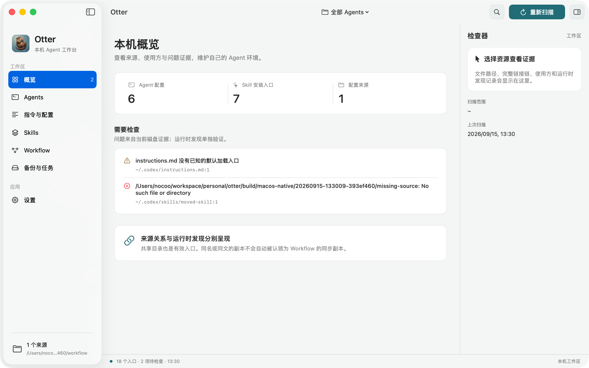
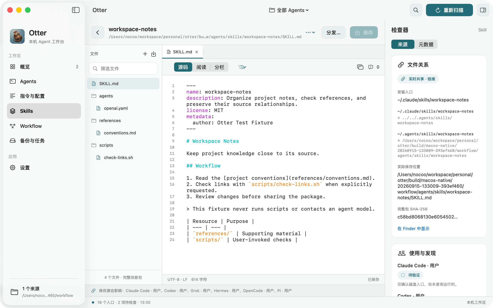
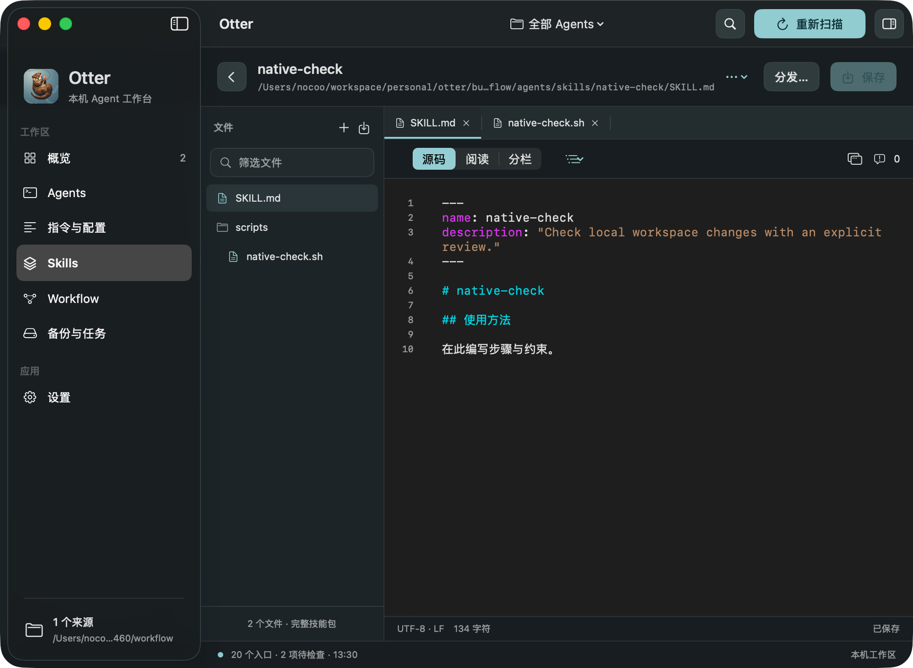

# Otter Agent Workspace 原生验证截图

2026-09-15，Apple Silicon、macOS 26.6.2、Xcode 26.6。以下截图来自实际运行的 SwiftUI / AppKit 应用，使用私有 fixture 和真实内置 CLI；画面中的配置与上传数据均为测试数据。

本次通过 29 项 XCTest 和 232 项原生 / 协议断言，生成 25 张截图，完成 2 次本地 gzip HTTP 上传，其中第二次由界面主动取消。这里保留 7 张原始截图；完整画廊位于仓库根目录下的 `build/macos-native/20260915-133009-393ef460/results/index.html`。

| 截图 | 验证内容 |
| --- | --- |
| [工作区概览](overview-light.png) | 本机入口、诊断与来源关系 |
| [Skill 编辑器](editor-light.png) | 包文件树、源码、行号与来源 Inspector |
| [独立编辑窗口](detached-editor-light.png) | 原生文档窗口与共享编辑状态 |
| [指令比较](instruction-comparison-light.png) | 当前指令与 Workflow 来源的内容比较 |
| [上传完成](upload-complete-light.png) | 内置 CLI 的真实阶段日志与上传结果 |
| [深色紧凑窗口](compact-dark.png) | 最小窗口中的编辑器布局与 Inspector 收起 |
| [重启恢复](recovered-draft-light.png) | 重新启动实际进程后恢复未保存草稿 |

报告：[运行摘要](native-summary.json)、[工作区断言](native-verification.json)、[重启恢复断言](native-recovery.json)、[XCTest 摘要](xctest-summary.json)、[Release 打包](package-verification.json)。运行摘要中的绝对路径已改为仓库相对路径，XCTest 摘要省略设备标识符；原始构建报告仍保留在 `build/`。

复现命令和当前发行边界见[实现与验证记录](../../03-macos-agent-workspace-implementation.md)。
